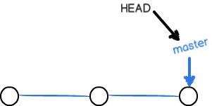
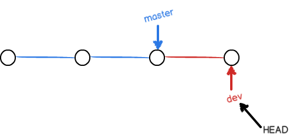
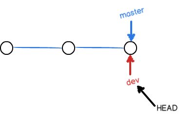
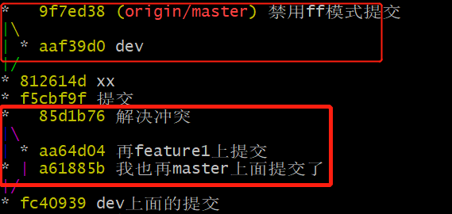

### **1.创建分支与合并**

1. 1分支的理解：实际上分支就是一条由commit时间点组成的时间线，分支指向当前的提交点，HEAD其实是指向当前分支，也就指向了当前提交

1.  2git  checkout -b dev  创建并切换到dev分支。

当我们切换到dev分支，master指向的点就不变了，此时HEAD指向dev分支，dev指向新的时间点。

1. 3git merge dev，分支的合并。在dev分支上修改了内容后，再切换到master分支，此时master指向上一个提交点，通过merge合并，fast-fworad到当前提交点，实现合并。

fast-fworad缺点是删除分支后，不能查看历史分支信息。可以采用 --no-ff 模式合并

 ==git merge --no-ff -m "禁用ff模式提交" dev，此时会在merge时生成一个新的commit==

git branch 查看本地分支

git branc -a查看所有分支，带*代表目前所在分支

### **2.stash** 

- 比较适用于开发到一般，需要切换分支
- 或者拉代码的时候，远端代码会覆盖本地，但是又必须先拉下来，就可以使用
- 保存	git stash save "comment"
- 查看 git stash list  git stash show (查看具体信息)
- 恢复: git stash pop “编号” （恢复后自动删除）

### **3.删除分支**

### **4.同一个行代码级别的冲突。**

- 在commit后，直接push或者先pull会提示conflict。这时可以使用
- git diff “文件名” 或者idea里面直接和远端分支对比。
- 解决冲突后，再git commit到缓存区，然后执行pull，这时就可以merge了