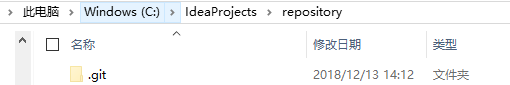
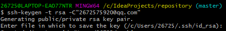
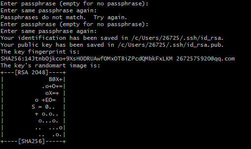
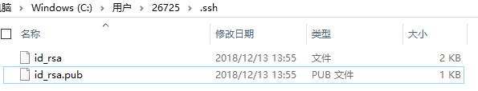
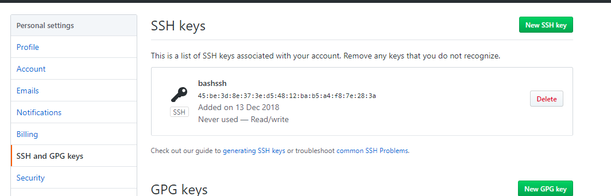

### **一.创建版本库repository**

==git init==

执行后该目录就可以被git管理



### *二.创建并设置SSH KEY**

利用远程仓库托管代码，同时别人也能看到，好处多多。

#### 2.1.登录github，创建远端repository


#### 2.2.创建SSH KEY

由于本地的git仓库和远程的github仓库之间的传输是通过SSH加密的，所以需要创建SSH KEY

```java
$ ssh-keygen -t rsa -C"2672575920@qq.com"
```



提示明确说会rsa生成 公/私钥,然后系统要求输入密码，可以直接按回车，重复密码也按回车，然后SSH KEY就生成了，如下



然后到本地当前用户的目录下生成一个.ssh文件夹



第一个是私钥，第二个是公钥

#### 2.3.登录GitHub，setting里面新增一个SSH KEY



把id_rsa.pub里面的字符串粘贴进去

#### 2.4 直接git clone

​	在对应目录下打开gitbash，执行git clone拉取项目直接可以提交

### **三.git bash 提交代码**

1.最好先切换到当前项目路径下

2.查看本地文件夹文件状态

#### **git status**

​	git st

- 查看文件状态
- 一般修改后未提交到暂存区会显示为红色，此时文件不受git管理

#### **git add file1 file2...**  

​	git add . 添加所有

​	提交本地文件到暂存区

#### **git commit -m "备注"**

​	git ci -m xxx

​	提交修改后的文件到本地仓库

**git pull**

- 先拉代码并合并代码，多人协作必要步骤
- 如果此时本地有不需要提交的文件冲突可以 git reset --hard 返回到git add的版本后再pull

**git push**

​	提交代码，因为本来在提交的分支下，所以不需要指定远程分支路径

### **四 常见的命令**

#### **git reset**

​	将提交到缓存区的文件删除

#### **git reset --hard  HEAD^ **

==（HEAD指向当前版本，^代表上一个版本）==

​	回退到上一个版本的内容，本地的更改将会被删除，回退之前备份文件

#### **git diff HEAD^**

​	pull后查看当前版本和上一个版本的差别