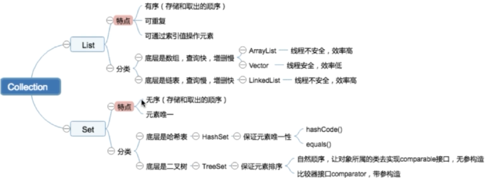
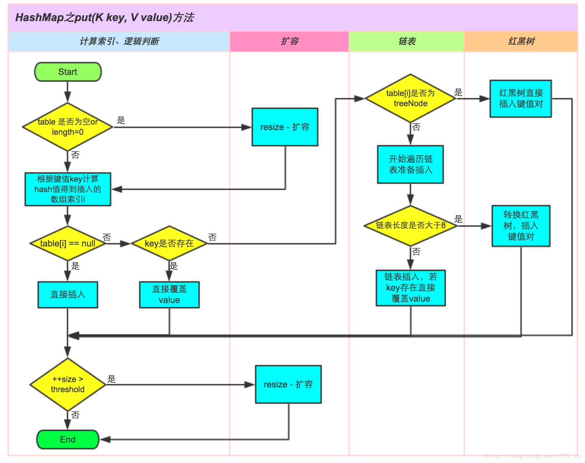
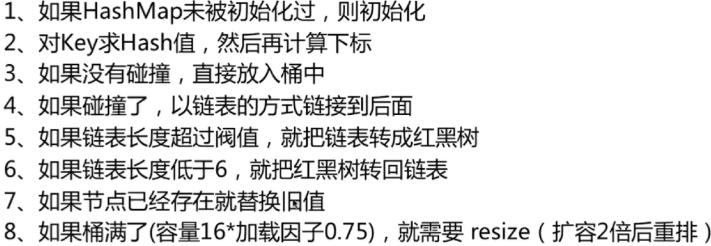

### 1.Collection



### 2.Map

#### 2.1 HashMap

##### 2.1.1 红黑树

[**https://my.oschina.net/hosee/blog/618828**](https://my.oschina.net/hosee/blog/618828)

##### 2.1.2 java8 前后hashmap源码的区别

java8以前：数组+链表。在性能恶化的情况下复杂度从O(1)--O(n)

java8及以后：数组+链表+红黑树。通过TREEIFY_THRESHOLD参数把最坏情况下的链表变成红黑树，复杂度从O(n)--O(logn)

##### 2.1.3 put方法源码分析

###### 2.1.3.1 源码图示



###### 2.1.3.2 源码分析

```java
public V put(K key, V value) {
    return putVal(hash(key), key, value, false, true);
}
final V putVal(int hash, K key, V value, boolean onlyIfAbsent,
               boolean evict) {
    Node<K,V>[] tab; Node<K,V> p; int n, i;
    //
    if ((tab = table) == null || (n = tab.length) == 0)
        n = (tab = resize()).length;
    //如果放入得位置没有数据，则直接放进去    
    if ((p = tab[i = (n - 1) & hash]) == null)
        tab[i] = newNode(hash, key, value, null);
    else {
        Node<K,V> e; K k;
        //否则，放入得位置有数据，则替换旧数据
        if (p.hash == hash &&
            ((k = p.key) == key || (key != null && key.equals(k))))
            e = p;
        //如果当前节点是TreeNode类型，那么执行putTreeVal()类型
        else if (p instanceof TreeNode)
            e = ((TreeNode<K,V>)p).putTreeVal(this, tab, hash, key, value);
        else {
            //否则，遍历这条链表，和java7一样
            for (int binCount = 0; ; ++binCount) {
                if ((e = p.next) == null) {
                    p.next = newNode(hash, key, value, null);
                    //这里多了个判断：如果长度大于等于7（8-1）那么就调用treeFybin()把链表转换为红黑树
                    if (binCount >= TREEIFY_THRESHOLD - 1) // -1 for 1st
                        treeifyBin(tab, hash);
                    break;
                }
                //如果放入位置有数据覆盖旧数据
                if (e.hash == hash &&
                    ((k = e.key) == key || (key != null && key.equals(k))))
                    break;
                p = e;
            }
        }
        if (e != null) { // existing mapping for key
            V oldValue = e.value;
            if (!onlyIfAbsent || oldValue == null)
                e.value = value;
            afterNodeAccess(e);
            return oldValue;
        }
    }
    ++modCount;
    //如果长度大于hashmap的初始化长度，则扩容。
    //也就是说resize()既可以初始化也可以扩容
    if (++size > threshold)
        resize();
    afterNodeInsertion(evict);
    return null;
}
```



##### 2.1.4  ge方法源码分析

##### 2.1.5 如何减少碰撞？

##### 2.1.6 扩容问题

参考地址：**（**[**https://blog.csdn.net/lch_2016/article/details/81045480**](https://blog.csdn.net/lch_2016/article/details/81045480)**）**

当达到hashmap阈值（DEFAULT_INITIAL_CAPACITY*loadFactory即16*0.75）后需要扩容，java数组是无法扩容的，所以需要重新生成一个大的数组来替换晓得数组。即：大桶换小桶

**a. JDK1.7的扩容**

rehash，生成一个新的数组后遍历entry（transfer()）,先计算出数组的位置，然后使用单链表头部插入，每次遍历插入都会在新链表的头部。

```java
int i = indexFor(e.hash, newCapacity);
e.next = newTable[i];
newTable[i] = e;
e = next;
```

如果扩容前后数组的索引位置相同，则会使链表"倒置"

**b. JDK1.8的扩容**

相对于1.7，1.8在扩容也有优化。使用的是：newThr = oldThr << 1，即2次幂的扩展，长度变为原来的2倍，这样在扩容后，元素要么在原来的位置，要么在2次幂的位置。

扩容的计算过程

##### 2.1.7 hashmap存在的问题

a.多线程环境下，调整大小会存在条件竞争，容易造成死锁

b.rehashing是一个比较耗时的过程

##### 2.1.8 hashmap死锁测试

#### 2.2 ConccurentHashMap

参考文章：**（**[**https://www.jianshu.com/p/c0642afe03e0**](https://www.jianshu.com/p/c0642afe03e0)**）**

##### 2.2.1 背景知识

a.**cas乐观锁，自旋重试机制（**[**https://www.jianshu.com/p/ae25eb3cfb5d**](https://www.jianshu.com/p/ae25eb3cfb5d)**）**

b.**Java中的Unsafe（**[**https://www.jianshu.com/p/a16d638bc921**](https://www.jianshu.com/p/a16d638bc921)**）**

##### 2.2.2 put方法源码分析

put方法调用putVal方法实现插入。

```java
public V put(K key, V value) {
    return putVal(key, value, false);
}
/** Implementation for put and putIfAbsent */
final V putVal(K key, V value, boolean onlyIfAbsent) {
    //插入的key或者value为空时抛出空指针异常
    if (key == null || value == null) throw new NullPointerException();
    //计算hash值 spread()
    int hash = spread(key.hashCode());
    int binCount = 0;
    for (Node<K,V>[] tab = table;;) {
        Node<K,V> f; int n, i, fh;
        //如果table为空就初始化数组
        if (tab == null || (n = tab.length) == 0)
            tab = initTable();
        // f头节点，如果f为空，说明是第一次插入元素。
        //通过调用 Unsafe.getObjectVolatile()来获取头节点的值，这里没用table[index]。
        //因为在java内存中，每个线程都存储着一份table的副本，虽然table是volatile修饰的，但是不能保证每次取到的都是最新的
        //使用U.getObjectVolatile()是直接获取内存的数据，保证每次拿到的都是最新数据
        else if ((f = tabAt(tab, i = (n - 1) & hash)) == null) {
            //如果头节点是null，调用U.compareAndSwapObject()插入Node节点
                //如果cas成功，说明插入成功，break退出循环，调用addCount(1L, binCount)检查是否需要扩容
            //如果cas失败，说明有其它线程提前插入节点，则自旋重新尝试在这个位置插入节点
            if (casTabAt(tab, i, null,
                    new Node<K,V>(hash, key, value, null)))
                break;                   // no lock when adding to empty bin
        }
        //如果fh（头节点hash值）=-1，则说明当前f是ForwardingNode节点，意味有其它线程正在扩容，则一起进行扩容操作。
        else if ((fh = f.hash) == MOVED)
            tab = helpTransfer(tab, f);
        //其他情况，把新的node插入链表或者红黑树，通过synchronized同步内置锁实现并发     
        else {
            V oldVal = null;
            synchronized (f) {
                //添加之前继续利用cas锁判断是否有其它线程修改过
                if (tabAt(tab, i) == f) {
                    //如果f.hash >= 0，说明f是链表结构的头结点，遍历链表，
                    //如果找到对应的node节点，则修改value，否则在链表尾部加入节点
                    if (fh >= 0) {
                        binCount = 1;
                        for (Node<K,V> e = f;; ++binCount) {
                            K ek;
                            if (e.hash == hash &&
                                ((ek = e.key) == key ||
                                 (ek != null && key.equals(ek)))) {
                                oldVal = e.val;
                                if (!onlyIfAbsent)
                                    e.val = value;
                                break;
                            }
                            Node<K,V> pred = e;
                            if ((e = e.next) == null) {
                                pred.next = new Node<K,V>(hash, key,
                                                          value, null);
                                break;
                            }
                        }
                    }
                   // 如果f是TreeBin类型节点，说明f是红黑树根节点，则在树结构上遍历元素，更新或增加节点。
                    else if (f instanceof TreeBin) {
                        Node<K,V> p;
                        binCount = 2;
                        if ((p = ((TreeBin<K,V>)f).putTreeVal(hash, key,
                                                       value)) != null) {
                            oldVal = p.val;
                            if (!onlyIfAbsent)
                                p.val = value;
                        }
                    }
                }
            }
            if (binCount != 0) {
                //如果链表中节点数binCount >= TREEIFY_THRESHOLD(默认是8)，则把链表转化为红黑树结构。
                if (binCount >= TREEIFY_THRESHOLD)
                    treeifyBin(tab, i);
                if (oldVal != null)
                    return oldVal;
                break;
            }
        }
    }
    addCount(1L, binCount);
    return null;
}
```

##### 2.2.3 扩容

#### 2.3HashMap,HashTable,ConcurrentHashMap的区别

1. hashMap是线程不安全的，底层通过数组+链表+红黑树实现
2. hashTable是线程安全的，底层数组+链表，通过锁住整个对象实现线程安全
3. concurrentHashMap是线程不安全的，底层数组+链表+红黑树，通过cas+同步锁（synchronized）实现线程安全
4. hashMap的key，value都可以为null，而另外两个不行

#### 2.4 JUC--java.util.concurrent

cas是java.util.concurrent.atomic的核心

aqs是java.util.concurrent.locks的核心

**BlockingQueue**

ArrayBlockingQueue

LinkedBlockingQueue

PriorityBlockingQueue

### 3 List

#### 3.1 ArrayList

##### 3.1.1 初始化

当 initialCapacity不为0时，初始化elementData,否则将elementData引用指向EMPTY_ELEMENTDATA，EMPTY_ELEMENTDATA两个空数组

```java
public ArrayList(int initialCapacity) {
    if (initialCapacity > 0) {
        this.elementData = new Object[initialCapacity];
    } else if (initialCapacity == 0) {
        this.elementData = EMPTY_ELEMENTDATA;
    } else {
        throw new IllegalArgumentException("Illegal Capacity: "+
                                           initialCapacity);
    }
}

public ArrayList() {
    this.elementData = DEFAULTCAPACITY_EMPTY_ELEMENTDATA;
}
```

##### 3.1.2 **add()方法**

添加前先判断 先调用ensureCapacityInternal方法判断是否需要扩容，确定前调用calculateCapacity（）确定数组长度，如果使用的是无参的构造函数初始化数组（DEFAULTCAPACITY_EMPTY_ELEMENTDATA），那么取数组的长度为默认长度（10），否则返回size+1。

现在调用 ensureExplicitCapacity 明确是否需要扩容 ，先modCount++记录操作记录，然后判断size+1-elementData.length是否>0,如果是则代表数组所需最小长度大于数组长度，则需要扩容。

扩容，调用 grow方法，先把旧数组扩容到1.5倍做为新数组的长度。如果新的长度还是小于最小数组长度，那么新数组长度取最小数组长度；

如果新的长度超过了 Integer.**MAX_VALUE** - 8，那么取数组长度为Integer.**MAX_VALUE（调用**hugeCapacity方法判断数组下标越界**）。**然后调用Arrays.copyOf（）复制数组。

扩容后添加元素。返回true。

```java
public boolean add(E e) {
    ensureCapacityInternal(size + 1);  // Increments modCount!!
    elementData[size++] = e;
    return true;
}

private void ensureCapacityInternal(int minCapacity) {
    ensureExplicitCapacity(calculateCapacity(elementData, minCapacity));
}

private static int calculateCapacity(Object[] elementData, int minCapacity) {
    if (elementData == DEFAULTCAPACITY_EMPTY_ELEMENTDATA) {
        return Math.max(DEFAULT_CAPACITY, minCapacity);
    }
    return minCapacity;
}

private void ensureExplicitCapacity(int minCapacity) {
    modCount++;

    // overflow-conscious code
    if (minCapacity - elementData.length > 0)
        grow(minCapacity);
}

private void grow(int minCapacity) {
    // overflow-conscious code
    int oldCapacity = elementData.length;
    int newCapacity = oldCapacity + (oldCapacity >> 1);
    if (newCapacity - minCapacity < 0)
        newCapacity = minCapacity;
    if (newCapacity - MAX_ARRAY_SIZE > 0)
        newCapacity = hugeCapacity(minCapacity);
    // minCapacity is usually close to size, so this is a win:
    elementData = Arrays.copyOf(elementData, newCapacity);
}
```

