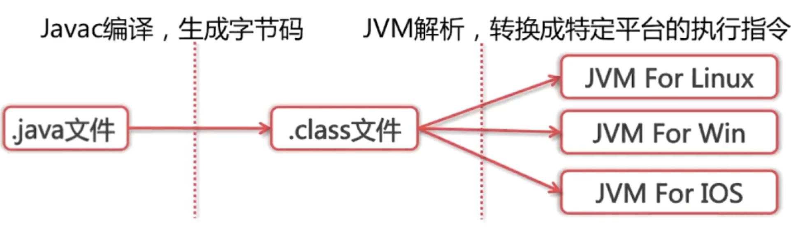
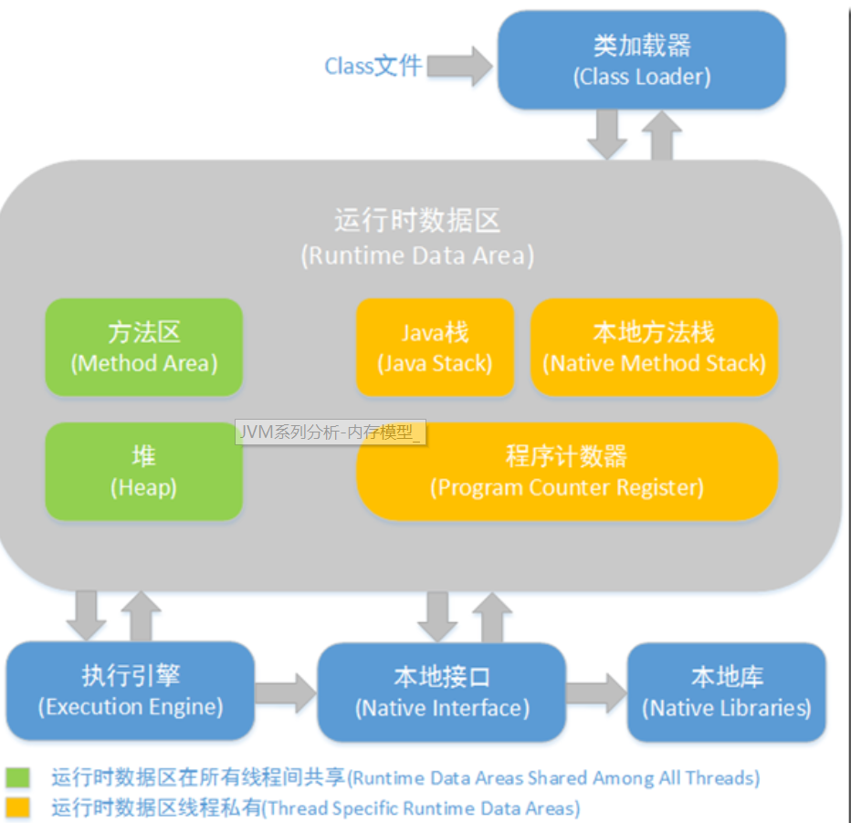
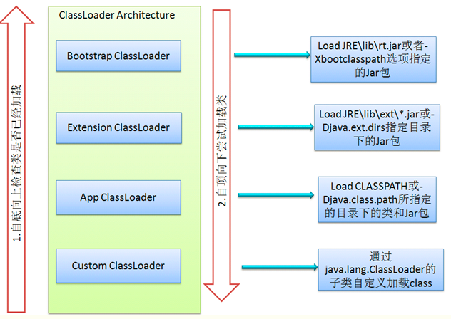
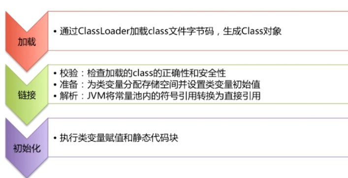

### 1.Compile Once ，Run Anywherer如何实现？



1. Java源码首先被编译成字节码，再由不同的平台JVM进行解析，Java语言在不同的平台上运行时不需要进行重新编译，Java虚拟机在执行字节码的时候，把字节码转换成具体平台上的机器指令。
2. jdk自带的反编译命令:javap -c file

### 2.java虚拟机（jvm）



#### **2.1.Class Loader** 

​	依据特定格式，加载class文件到内存。只要符合class loader的格式要求就可以加载，不需要管能不能运行

#### **2.2.Execution Engine（解释器）**

​	对命令进行解析，解析完后提交给操作系统

#### **2.3.Native Interface（本地接口）**

​	融合不同的开发语言的原生库为java所用（不重复造轮子）

#### **2.4.Runtime Data Area**

​	 Jvm内存模型

### 3.什么是反射?

​	java反射机制是在运行状态中，对于任意一个类，都能够知道这个类所有的属性和方法；对于任意一个对象，都能够调用它的任意方法和属性；这种动态获取信息以及动态调用方法的功能称为java语言的反射机制。

举例：通过反射获取私有，共有方法和私有的属性的？

==getDeclaredMethod()可以获取该类的 所有方法，但是不能获取基础的方法或者该类实现的方法==

==getMethod()获取公有方法及其继承方法==

==获取所有的属性和方法，都是通过类；设置具体参数和方法都调用具体对象==

==结论：反射就是把类的各个成分都映射成java对象==

### 4.classLoader的作用

ClassLoader在java中有着非常重要的作用，它主要工作在class装载的加载阶段，其主要作用是从外部获得二进制数据流，他是java的核心组件，所有的class都是由classLoader加载的。classLoader负责将class文件里的二进制数据流装载进系统，谈后交给java虚拟机进行连接，初始化等操作。

### 5.classLoader的分类

1. BootStrapClassLoader：C++编写，加载核心库java.
2. ExtClassLoader:Java编写，加载扩展库javax.*
3. AppClassLoader :Java编写，加载程序所在目录
4. 自定义的ClassLoader：java编写，定制化加载

### 6.类加载器ClassLoader的双亲委派机制



实现双亲委派机制的代码。

 由代码可以看出来，

​	1.实现双亲委派机制在lang中的loadClass()方法中

​	2.“First, check if the class has already been loaded”，首先检查请求加载的类是否已经被加载过

3. c = parent.loadClass(name, false); 如果没有被加载过，则递归父类加载器的loadClass（）；
4. 如果都无法加载，则调用自身的findClass()加载。
5. 否则抛出ClassNotFoundException异常。

==总结：在接收到某个类加载请求，首先将加载任务委托给父类加载，并依次递归，如果父类可以完成加载，就成功返回；当父类加载器无法完成加载任务，就自己加载。如果都无法完成，就抛出ClassNotFoundException异常==

```java
protected Class<?> loadClass(String name, boolean resolve)
    throws ClassNotFoundException
{
    synchronized (getClassLoadingLock(name)) {
        // First, check if the class has already been loaded
        Class<?> c = findLoadedClass(name);
        if (c == null) {
            long t0 = System.nanoTime();
            try {
                if (parent != null) {
                    c = parent.loadClass(name, false);
                } else {
                    c = findBootstrapClassOrNull(name);
                }
            } catch (ClassNotFoundException e) {
                // ClassNotFoundException thrown if class not found
                // from the non-null parent class loader
            }

            if (c == null) {
                // If still not found, then invoke findClass in order
                // to find the class.
                long t1 = System.nanoTime();
                c = findClass(name);

                // this is the defining class loader; record the stats
                sun.misc.PerfCounter.getParentDelegationTime().addTime(t1 - t0);
                sun.misc.PerfCounter.getFindClassTime().addElapsedTimeFrom(t1);
                sun.misc.PerfCounter.getFindClasses().increment();
            }
        }
        if (resolve) {
            resolveClass(c);
        }
        return c;
    }
}
```

### 7.双亲委派机制的好处？

其实每个加载器都有自己的加载目录，双亲加载机制保证了一定的加载顺序，并且保证内存中只加载一份在内存中。

### 8.类的装载过程？



### 9.forName和loadClass的区别？

forName得到的类是已经加载完了的（initialize=true）

classLoader.loadClass得到的类是未链接的（resolve=false）

测试：由于static代码块在初始化的时候就会加载，所以利用这个特性测试。

```java
    public static void main(String[] args) throws ClassNotFoundException {
        //static属性会在类初始化的时候加载
       // ClaclassLoaderss c  = Class.forName("reflect.Cat");  //输出：this is static method.
        ClassLoader  classLoader= Cat.class.getClassLoader();  //什么都没输出
    }
/*
  静态代码块
  static{
        System.out.print("this is static method.");
    }
*/
```


### ==### 面试题------------------------------==

### 1.类加载机制，为什么要从上往下加载，好处是什么

Java类随着它的类加载器一起具备了一种带优先级的层级关系。保证了类的唯一性，如rt.jar中的Object类，无论哪一个类加载器加载都委派给了BootStrap这个类加载器，因此Object在程序的各种类加载环境中都是同一个类。相反，如果没有双亲委派模型，那用户自定义一个类加载器加载Object，则环境中会出现多个Object类，系统将混乱

### 2.类加载为什么要使用类加载器？

作用：

（1）保证Java类型体系中最基础的行为

（2）Java类随着它的类加载器一起具备了一种带优先级的层级关系。保证了类的唯一性，如rt.jar中的Object类，无论哪一个类加载器加载都委派给了BootStrap这个类加载器，因此Object在程序的各种类加载环境中都是同一个类。相反，如果没有双亲委派模型，那用户自定义一个类加载器加载Object，则环境中会出现多个Object类，系统将混乱

什么场景破坏：

（1）线程上下文，Java中所有涉及SPI的加载动作基本上都采用这种方式，例如JNDI,JDBC,JCE,JAXB和JBI等。父类加载器请求子类加载器去完成类加载动作

（2）OSGI，在OSGi环境下，类加载器不再是双亲委派模型中的树状结构，而是进一步发展为网状结构。

### 3.类的实例化顺序

先静态方法（类初始化），再构造方法，每个又是先基类（父类）后子类