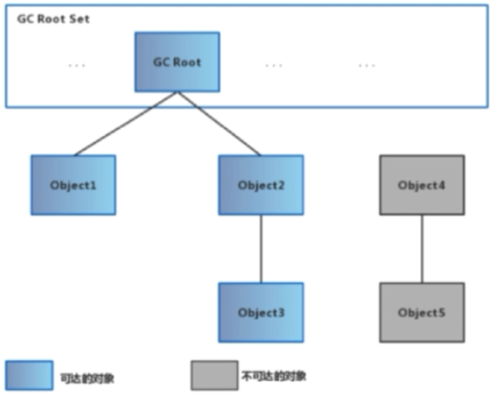
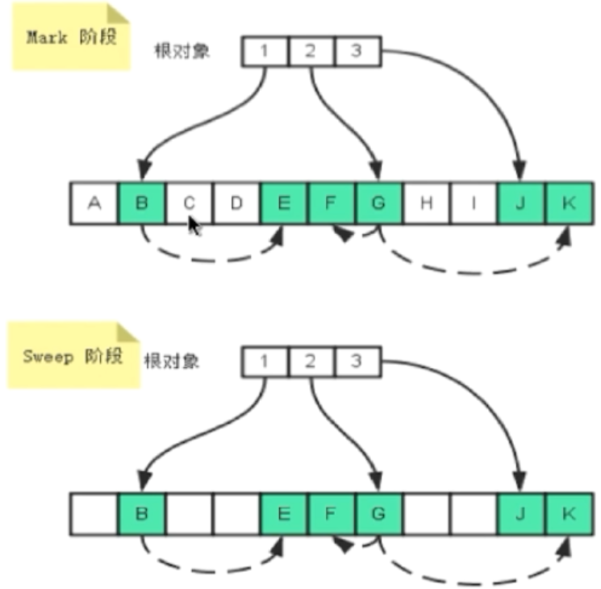
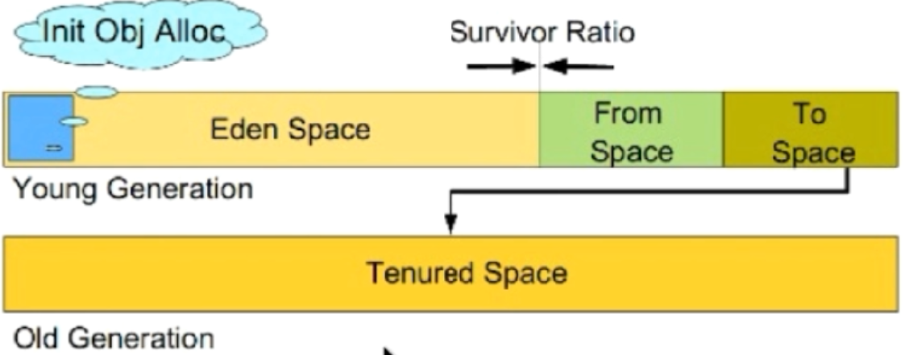
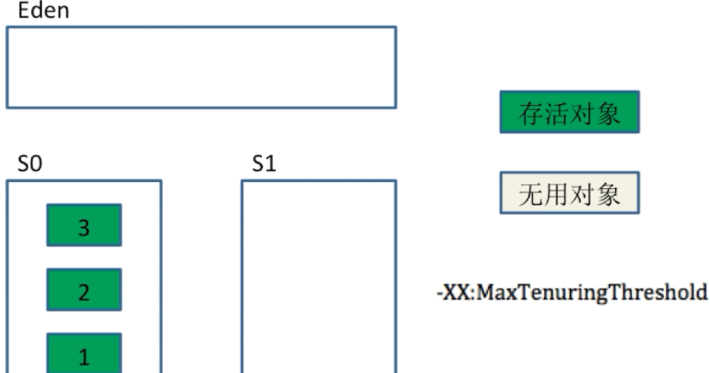
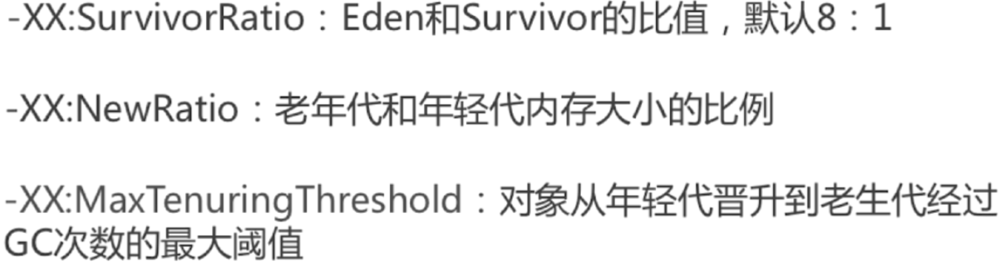
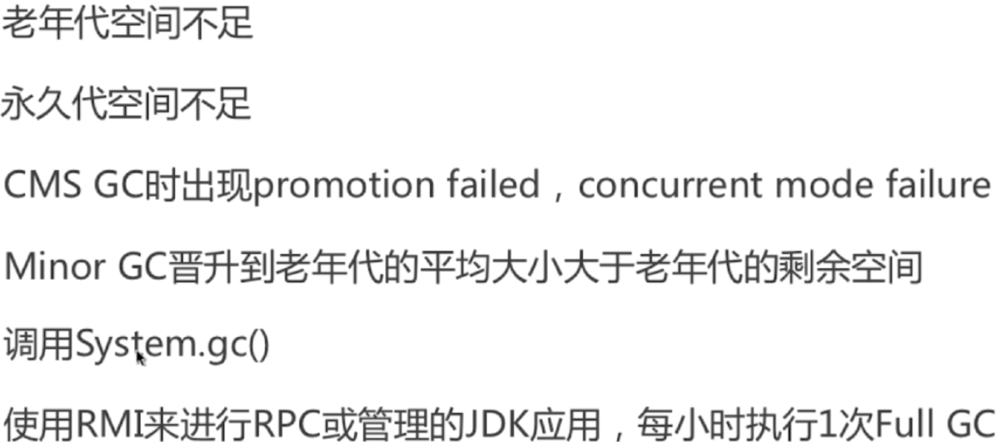
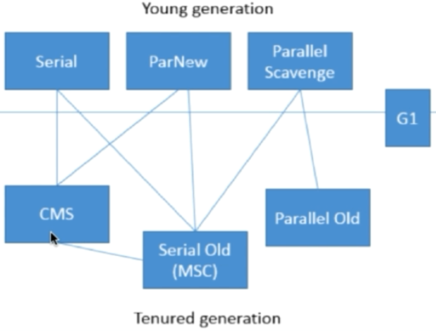
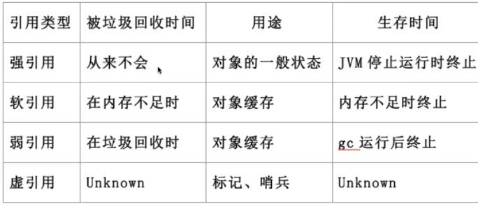
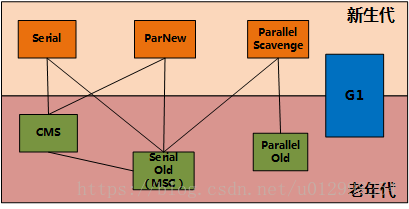

### 1.被判定为垃圾的标准?

没有被其他对象引用

### 2.判断是否垃圾的算法

#### 2.1引用计数算法 （没有使用	）

通过判断对象的引用数量来决定对象是否可以被回收‘

每个对象实例都有一个引用计数器，引用则+1，完成引用则-1	

任何引用计数为0的对象都可以被回收

优点：执行效率高，程序受影响小

缺点：无法检测出循环引用的情况，导致内存泄漏

#### ==2.2.可达性分析算法==

通过判断对象的引用链是否可达来决定对象是否可以被回收。



**可以作为GC Root 的对象**

1. 虚拟机栈中引用对象（栈帧中的本地变量表）
2. 方法区的常量引用对象
3. 方法区中的类静态属性引用的对象
4. 本地方法栈中JNI（Native方法）的引用对象
5. 活跃线程的引用对象

### 3.垃圾回收算法 

#### **3.1.标记-清除算法（Mark and Sweep）**

==标记：从根集合进行扫描，对存活的对象标记==

==清除：对堆内存从头到尾进行线性遍历，回收不可达对象内存。并清除可达对象的标记。==



==特点==

==碎片化，内存不连续，可能造成无法存储比较大的对象。==

#### **3.2.复制算法（coping）**

1. 分为对象面和空闲面
2. 对象在对象面上创建
3. 存活的对象被从对象面复制到空闲面
4. 将对象面所有的对象内存清除

 特点：适用于对象存活率低的场景；

- 1. 解决了碎片化问题
  2. 顺序分配内存，简单高效

#### **3.3 .标记-整理算法（Compacting）**

标记:从根基和进行扫描，对存活的对象进行标记

清除：移动所有存活的对象，且按照n内存地址依次排列，然后将末端内存地址以后内存全部回收。

特点：避免了内存不连续

1.  适用于存活率高的场景
2.  不用设置两块内存互换

#### **3.4.分代收集算法（Generationl Collector）**

按照对象生命周期不同划分区域以采用不同的垃圾回收算法

特点:提高jvm的回收效率

jdk8及以后的内存模型




==年轻代一般采用复制算法(存活率低)，老年代一般采用标记-清除，标记-整理算法。==

##### **3.4.1.Enden区**：“伊甸园”，新生成的对象都存放在Enden区，也有可能在其他区

##### **3.4.2.两个Survuvor区**：from，to区，可以相互转换，比例为8：1：1

### 4.分代收集算法的分类

#### **4.1.Minor GC**

从年轻代空间（包括 Eden 和 Survivor 区域）回收内存被称为 Minor GC

1.主要回收过程演示图，例如：回收前，把Edne区存活的对象复制到S0，S0复制到S1，然后回收Eden剩余对象，回收一次年龄+1



**Major GC** 是清理老年代。

**Full GC** 是清理整个堆空间—包括年轻代和老年代。

### 5.对象如何进入老年代区？

1.经历一定的次数的Minor GC 依然存活

2.Survivor区存放不下的对象

3.新生成的大对象（-XX:+PretenuerSizeThreshod）,超过这个值直接进入老年代区

### 6.常用的性能调优参数



其中，老年代和年轻代内存大小通过jvm参数设置

### 7.老年代

Full GC和Major GC,Full GC比Major GC 慢，频率不高

**Full GC条件**



==**其中调用System.gc()也只是提醒jdk，但是具体回不回收，jdk决定**==

### 8.Stop-the-world

cms收集器

### 9.Safepoint

分析过程中对象引用关系不会发生变化的点

产生SafePoint的地方：方法调用；循环跳转；异常跳转等

安全点数量适中

### 11.垃圾收集器之间的联系



==CMS不能与G1和Parallel Scavenge共存，是因为她两采用了不同的垃圾收集器框架==

### 12.Young generation常用垃圾收集器

#### **12.1.Serrial 收集器（-XX:+UserSerialGC，复制算法）**

单线程收集，进行垃圾收集时，必须暂停所有的工作线程

简单高效，Client模式下默认的年轻代收集器

#### **12.2.ParNew 收集器（-XX:+UseParNewGC，复制算法）**

多线程收集，其他行为和serial收集器一样

单核执行效率不如serial，因为存在多线程开销。在多核下才有优势

默认开启的收集线程数和cpu数量相同

#### **12.3.Parallel Scavenge收集器（-XX:+UseParallelGC，复制算法）**

吞吐量=运行用户代码时间**/**(运行用户代码时+垃圾收集时间）

关注吞吐量，高效利用cpu

server模式下默认的年轻代收集器

#### **12.4.XX:+UseAdaptiveSizeGC**

自适应调节策略，把内存管理的调优交给虚拟机、

### 13.Tenured generation常用垃圾收集器

#### **13.1.Serial Old 收集器（-XX:+UserSerialOldGC，标记-整理算法）**

特点和年轻代一样，是client模式下默认的老年代收集器

#### **13.3.Parallel Old收集器（-XX:+UseParallelGC，标记-整理算法）**

jdk6后停用

#### **13.3.CMS收集器（-XX:+UserConcMarkSweepGC，标记-清除算法）**

**Concurrent Mark-Sweep Collector** 

​	 [**https://blog.csdn.net/zqz_zqz/article/details/70568819**](https://blog.csdn.net/zqz_zqz/article/details/70568819)

1. 初始标记：stop-the-world。程序停顿，标记存活的对象：

   标记老年代中所有的GC Roots对象

   标记年轻代中活着的对象引用到的老年代的对象（指的是年轻带中还存活的引用类型对象，引用指向老年代中的对象）

2. 并发标记：并发追溯标记，程序不会停顿。从“初始标记”阶段标记的对象开始找出所有存活的对象;

3. 并发清理标记：查找执行并发标记阶段从年轻代晋升到老年代的对象（前一个阶段已经说明，不能标记出老年代全部的存活对象，是	因为标记的同时应用程序会改变一些对象引用，这个阶段就是用来处理前一个阶段因为引用关系改变导致没有标记到的存活对象的）

4. 重新标记：暂停虚拟机，扫描CMS堆中剩余对象

5. 并发清理：清理垃圾对象，程序不会暂停

6. 并发重置：重置CMS收集器的数据结构

==**13.4.G1收集器（启动:-XX:+UseG1GC，复制+标记-整理算法）**==

[**https://www.jianshu.com/p/0f1f5adffdc1**](https://www.jianshu.com/p/0f1f5adffdc1)

==特点：并行和并发，分代收集，空间整合，可预测停顿。==

==将整个java堆内存划分成多个大小相等的Region==

==年轻带和老年代不再物理隔离==

### 14..Object的finalize()方法的作用是否与C++的析构函数作用相同？

​	不同，析构函数（执行与构造函数相反的操作，没有一次构造函数的调用就有一次析构函数的调用）是调用确定的，而finalize()调用是不确定的。

1. 将未被引用的对象放置于F-Queue队列
2. 方法执行随时可能会被终止
3. 给与对象最后一次重生的机会

```java
public class Finalization {
    public static Finalization finalization;
    //执行gc时调用
    @Override
    protected void finalize(){
        System.out.println("Finalized");
        finalization=this;
    }
    //1
    public static void main(String[] args) {
        Finalization f = new Finalization();
        System.out.println("first: "+f);
        f = null;
        System.gc();
        System.out.println("second: "+f);
        System.out.println(f.finalization);
    }
    //2
    public static void main(String[] args) {
    Finalization f = new Finalization();
    System.out.println("first: "+f);
    f = null;
    System.gc();
    try {
        Thread.currentThread().sleep(1000);
    } catch (Exception e) {
        e.printStackTrace();
    }
    System.out.println("second: "+f);
    System.out.println(f.finalization);
    }
}
运行结果：

first: gc.Finalization@74a14482

second: null

null

Finalized。
```

说明:在执行System.gc()的时候调用finalize()并没有执行到 finalization=this;即说明了方法执行随时可能被终止

```java
first: gc.Finalization@74a14482

Finalized

second: null

gc.Finalization@74a14482
```

说明：在线程等待1s之后，finalize()执行完毕，给与对象最后一次重生的机会

### 15.java中的强引用，软引用，弱引用，虚引用有什么用?

#### **15.1.强引用 strong reference**

1. 最普遍的引用：Object obj=new Object();
2. 宁愿抛出OutOfMemoryError终止程序也不会回收具有强引用的对象
3. 只有通过显示的将对象置为null来弱化引用，使其被回收

#### **15.2.软引用 soft reference**

1. 对象处在有用但非必须的状态
2. 只有当内存空间不足时，GC会回收该引用的对象内存
3. 可以用来实现高速缓存

```java
String a = new String("a");//强引用
SoftReference<String> softRef = new SoftReference<>(a);//软引用
```

#### 15.3.弱引用 weak reference

1. 非必须的对象，比软引用更弱一些
2. GC时会被回收
3. 被回收的概率不大，因为GC线程优先级比较低
4. 适用于引用偶尔被使用且不影响垃圾收集的对象

```java
WeakReference<String> weakRef = new WeakReference<>(a);
```

#### **15.4虚引用 Phantom Reference**

不会决定对象的生命周期

任何时候都可能被垃圾收集器回收

起哨兵作用，可以跟踪垃圾收集器的活动

必须和引用队列ReferenceQuenue联合使用

```java
ReferenceQueue queue = new ReferenceQueue();
PhantomReference phantomRef = new PhantomReference(a,queue);
```

#### **15.5.引用队列 reference queue**

无实际存储结构，存储逻辑依赖于内部节点之间的关系来表达

#### 15.6.总结



### 面试题---------------

### 1.垃圾回收算法

1.复制算法--作用于新生代

2.标记-清除--作用于老年代

3.标记-整理--作用于老年代

### 2.CMS的回收步骤

使用标记-清除算法

1.初始标记，独占CPU，仅标记GC roots能直接关联的对象

2.并发标记，可以和用户线程并行执行，标记所有可达对象

3.重新标记，独占CPU（STW），对并发标记阶段用户线程运行产生的垃圾对象进行标记修正

4.并发清除，可以和用户线程并行执行，清理垃圾

**优点：**

并发，低停顿

**缺点：**

标记-清除算法会带来很多的内存碎片，给大对象空间的分配带来很大的麻烦，往往出现老年代还有很大的空间但无法找到足够大的连续空间来分配当前对象，不得不提前触发一次Full GC

### 3.G1和CMS的区别

1.分代： CMS中，堆被分为PermGen(jdk1.8时mataspace)，YoungGen，OldGen；而YoungGen又分了两个survivo区域。在G1中，堆被平均分成默认是2048个几个区域(region)，在每个区域中，虽然也保留了新老代的概念，但是收集器是以整个区域为单位收集的。 

2.算法： 相对于CMS的“标记——清理”算法，G1会使用压缩算法，保证不产生多余的碎片。收集阶段，G1会将某个区域存活的对象拷贝的其他区域，然后将整个区域整个回收。 

3.停顿时间可控： 为了缩短停顿时间，G1建立可预存停顿模型，这样在用户设置的停顿时间范围内，G1会选择适当的区域进行收集，确保停顿时间不超过用户指定时间。

### 4.G1内部是如何分区的（region）

G1默认把堆内存分为1024个分区，后续垃圾收集的单位都是以Region为单位的。Region是实现G1算法的基础，每个Region的大小相等，通过-XX:G1HeapRegionSize参数可以设置Region的大小

E代表Eden区，S代表Survivor区，O代表Old区，H代表Humongous大对象（大小是region的一般的空间对象）

### 5.G1停顿吗

 为了缩短停顿时间，G1建立可预存停顿模型，这样在用户设置的停顿时间范围内，G1会选择适当的区域进行收集，确保停顿时间不超过用户指定时间

### 6.说一下gc算法以及分代回收算法

1.复制算法--作用于新生代

2.标记-清除--作用于老年代

3.标记-整理--作用于老年代

4.分代回收--根据不同各个年代的特点采用适合的算法，如：新生代，每次收集有大量对象死去，那采用复制算法，每次只需要复制少量的对象。老年代对象存活率较高，没有额外的空间担保，则使用标记-清除或标记-整理比较好

### 7.垃圾收集器

作用于新生代的收集器：

1.Serial，单线程，使用复制算法

2.ParNew，Serial的多线程版本

3.Parallel，并行的多线程收集器

作用于老年代的收集器：

1.SerialOld，单线程，使用标记-整理算法

2.ParallelOld，多线程，使用标记-整理算法

3.CMS，具有跨时代意义的收集器，使用标记-清除算法：

（1）初始标记，仍然要stop the world，相对停顿时间最短

（2）并发标记，进行GC Roots Tracing，停顿时间一般

（3）重新标记，仍然要stop the world，停顿时间最长

（4）并发清除

新生代和老年代都可以收集

G1收集器

目前最先进的收集器，通过Region的思想进行Rememberd Set

（1）初始标记

（2）并发标记

（3）最终标记

（4）筛选回收



### 8.什么是动态对象年龄判断?

默认情况下除了大对象直接分配到老年代，新生代对象要晋升到老年代，要经历15次Minor GC，是不是一定要经历15次Minor GC才能晋升？

不是，因为在Survivor中所有年龄相等的对象大小总和大于Survivor大小的一半(-XX:TargetSurvivorRatio目标存活率，默认为50%)，那么年龄大于等于该年龄的对象直接进入老年代，无须等MaxTenuringThreshold（默认15）次Minor GC

### 9.怎样判断类可以被卸载（也就是判断"无用的类"可以回收）

（1）类的所有实例都已经被回收，也就是堆中不存在这个类的任何实例

（2）该类的classLoader已经被回收

（3）该类队以ing的java.lang.Class对象没有在任何地方被引用，无法在任何地方通过反射访问类的方法

### 10.什么是STW（stop the world），哪些情况可以引起STW

STW，全局暂停

1.GC操作，要做可达性分析（如果不暂停，可能引起引用链的变化）

2.取消偏向锁

3.各种调试操作

4.JIT相关，比如Code deoptimization, Flushing code cache ；

### 11.强引用，软引用，弱引用，虚引用

#### **11.1.强引用**

```java
String s = new String("123');
```

宁愿抛出OOM异常，也不回收

#### **11.2.软引用**

```java
SoftReference<String> soft = new SoftReference<>(s, new ReferenceQueue<String>)
```

在内存不足时回收，可以用于图片或者网页缓存，避免OOM(OutOfMemeoryError)

#### **11.3.弱引用**

```java
WeakReference<String> weak= new WeakReference<>(s, new ReferenceQueue<String>)
```

不管内存足不足，在GC的时候回收，jdk动态代理里面就使用了弱引用

#### **11.4.虚引用**

```java
PhantomReference<String> phantom= new PhantomReference<>(s, new ReferenceQueue<String>
```

任何时候都可能会被回收，可以用于跟踪对象被垃圾回收的活动。一般可以通过虚引用达到回收一些非java内的一些资源比如堆外内存的行为，如DirectByteBuffer 中，会创建一个 PhantomReference 的子类Cleaner的虚引用实例用来引用该 DirectByteBuffer 实例，Cleaner 创建时会添加一个 Runnable 实例，当被引用的 DirectByteBuffer 对象不可达被垃圾回收时，将会执行 Cleaner 实例内部的 Runnable 实例的 run 方法，用来回收堆外资源