### java1.JMM：java内存模型

​	java内存模型本身就是一个抽象的概念，并不真实存在，它描述的是一组规范或者规则，通过这个规范定义了程序各个变量的访问方式

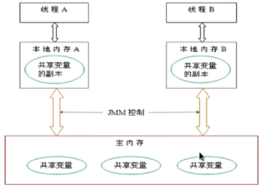

#### **1.1.JMM中的主内存**

存储java实例

包括成员变量，类信息，常量，静态变量

属于数据的共享区域，多个线程操作时会引发线程安全问题

#### **1.2工作内存**

存储当前方法所有本地变量信息，还存储了行号指示器，Native方法信息等，本地变量对其他线程不可见 ；属于私有数据，不存在线程安全问题。

#### **1.3 JMM和java内存结构的区别**

#### **1.4 JMM如何解决可见性的问题**

通过happens-before原则推导出来的，才能进行指令重排序

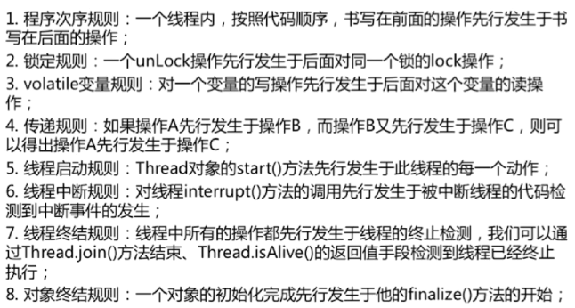

#### **1.5 volaltile关键字：JVM提供的轻量级同步机制**

保证被volalite修饰的共享变量对所有的线程总是可见的

禁止重排优化。

如何对所有线程可见？

当写一个volatile变量时，JMM会把该线程对应的工作内存中的共享变量刷新到主内存中；

当读一个volatile变量时，JMM会把该线程对应的工作内存置为无效。只能重新从主内存读取

如何禁止重排序优化?

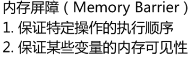

#### **1.6 结论**

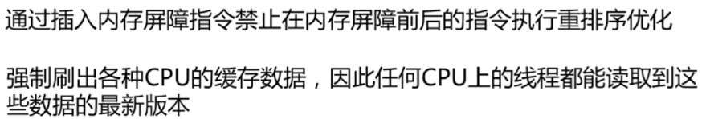

### 2.**JDK8：内存模型**

#### **2.1 堆内存（Heap）**

堆内存是JVM内存模型中最大的一块区域，被所有线程共享，是在JVM启动时候进行创建的。几乎所有的对象的空间分配都是在堆内存上进行分配的。

考虑到JVM的内存回收机制，堆内存可以划分为新生代和老年代两个区域（默认新生代与老年代的空间大小为1：2）。新生代可以再划分为Eden区、From Survivor区和To Survivor区（三者比例为8：1：1）。几乎所有的新对象的创建都是在Eden区进行的。在垃圾回收（GC）过程中，Eden中的活跃对象会被转移到Survivor区，当再到达一定的年龄（经历过的Minor GC的次数），会被转移到老年代中。

堆可以处于物理上不连续的内存空间中，但是需要满足逻辑上的连续。在实现时，可以实现成固定大小的，也可以是可扩展的，不过当前主流的虚拟机都是按照可扩展来实现的

#### 2.2.Metaspace

(**[**https://www.cnblogs.com/duanxz/p/3520829.html**](https://www.cnblogs.com/duanxz/p/3520829.html)**)**

​	PermGen Pace永久带用于存放Class信息和Meta信息，Method对象，包含了虚拟机中所有可通过反射获取到的数据，它和存放Instance Heap区域不同，所以你的app加载很多Class的话，就会发生PermGen Space错误。在JDK7中，PermGen从方法区移动到堆中，在JDK8中jvm移除了PermGen Pace。但类的元数据信息（metadata）还在，只不过不再是存在连续的堆空间上，而是移动到MetaSpace的Native Memory中

元空间的本质和永久代类似，都是对JVM规范中方法区的实现。不过元空间与永久代之间最大的区别在于：元空间并不在虚拟机中，而是使用本地内。因此，默认情况下，元空间的大小仅受本地内存限制，但可以通过以下参数来指定元空间的大小。

#### **2.3.程序计数器(Program Counter Register)**

当前线程所执行的字节码行号的指示器（逻辑）

改变计数器的值来选取下一条需要执行的字节码指令

和线程是一对一的关系，即是线程私有

只对java方法计数,计数器中保存的是字节码的行号，如果是Native方法则计数器的值为空Undefined

不会发生内存泄露

#### **2.4.Java虚拟机栈（JVM Stack）**

java栈是线程私有的内存区域，其中存储的是栈帧。对于一个java的方法，其开始调用，则会创建一个栈帧，保存到java栈中；当该方法执行完成，则对应的是出栈的过程。比如：方法methodOne方法调用了methodTwo，那么methodOne就会先入栈创建一个栈桢，接着methodTwo再入栈成为栈顶(假设没有其他的方法执行)，methodTwo执行完先出栈，接着methodOne执行完出栈。

每个栈针中，主要包含局部变量表，操作栈，动态链接和方法出口等。结构如下

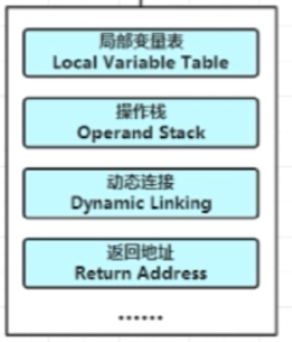

**一个栈针**的逻辑结构图，1+2=3的执行过程

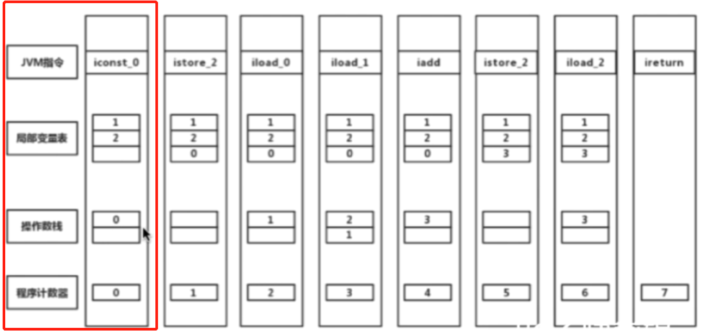

入栈

出栈

入栈

入栈

相加

出栈

入栈

返回

#### **2.5局部变量表和操作数栈**

​	局部变量表:包含方法执行过程中的所有变量，包括8种基本的数据类型：byte,chart,short,int,float,long,double,boolean（由于long和double是64位，会占用两个局部变量的空间)，对象引用和返回地址（return address）类型。

操作数栈：入栈，出栈，复制， 交换，产生消费变量

在Java虚拟机规范中，对这个区域规定了两种异常状况：如果线程请求的栈深度大于虚拟机所允许的深度（比如递归调用的时候），将抛出==**StackOverflowError**==异常；如果虚拟机栈可以动态扩展（当前大部分的Java虚拟机都可动态扩展，只不过Java虚拟机规范中也允许固定长度的虚拟机栈），当扩展时无法申请到足够的内存时会抛出==**OutOfMemoryError**==异常。

#### **2.6.本地方法栈（Native Stack）**

​	本地方法栈也是线程私有的内存区域，与java栈比较相似，不同之处在于该区域主要是保存Native方法相关的数据。Native方法是非Java语言编写的方法。也可以出StackOverflowError和OutOfMemeoryError。

### 3.举例元空间，堆，线程内存角度分析（分别存在什么地方）

```java
public class HelloWorld {
    private String name;
    public void sayHello(){
        System.out.println("hello"+name);
    }
    public void setName(String name){
        this.name=name;
    }
    public static void main(String[] args) {
        int a = 1;
        HelloWorld helloWorld = new HelloWorld();
        hW.setName("test");
        hw.sayHello();
    }
}
```

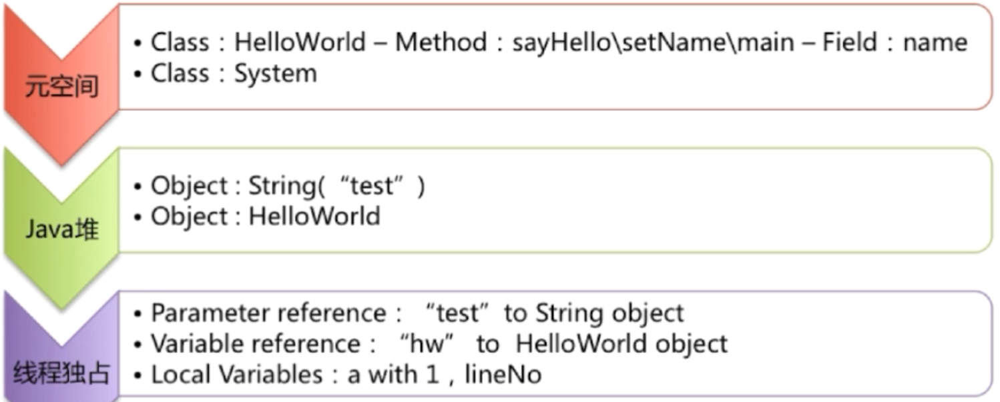

当类被加载进来的时候，metaspace保存了class信息，成员变量和方法信息（如图），heap存放了"test","helloWord"实例信息。

当程序执行的时候，main线程会分配对应的虚拟机栈（JVM stack），本地栈（native stack）,程序计数器（PC register）。栈里面存储的是String类型的引用，HelloWord对象的引用hw，局部变量1，行号记录代码的执行位置。

### 4.java.lang.StackOverflowMemeoryError异常

递归调用容易出现

### 5.元空间MetaSpace相比永久代PermGen的区别？

元空间使用本地内存，而永久代使用的是jvm内存

异常区别:java.lang.StackOverflowMemeoryError:PermGen space

### 6.元空间MetaSpace相比永久代PermGen的优势

1. 字符串常量池存在永久代中，容易出现性能问题和内存溢出
2. 类和方法的信息大小难以确定，给永久代的大小指定带来困难
3. 永久代会为GC带来不必要的复杂性
4. 方便HotSpot与其他jvm如Jrockit集成
5. 元空间并不在虚拟机中，而是使用本地内存。因此，默认情况下，元空间的大小仅受本地内存限制。

### 7.JVM三大性能调优参数-Xms -Xmx -Xss的含义？

调优参数讲解https://www.cnblogs.com/likehua/p/3369823.html

-Xss：规定了每个线程虚拟机栈（堆栈）的大小

-Xms：堆的初始值 默认512m

-Xmx：堆能达到的最大值 默认1024m

### 8.堆和栈？区别？

静态存储：编译时确定每个数据目标在运行时的存储空间的需求

栈式存储：数据区需求在编译时未知，运行时模块入口前确定

堆式存储：编译时或运行时模块都无法确定，动态发配

联系：引用对象，数组时，栈里定义变量保存堆中目标的首地址

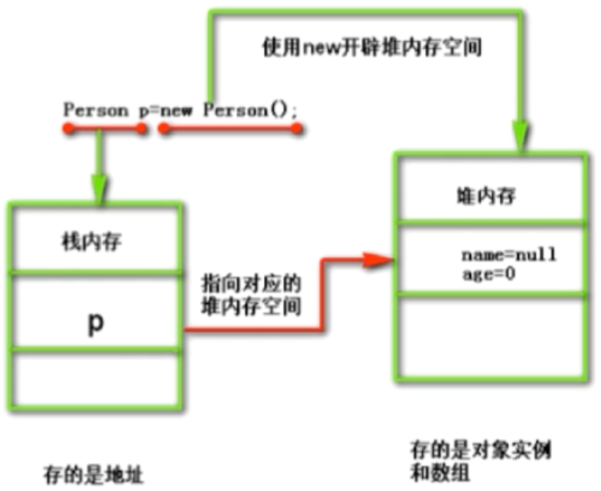

**区别**

管理方式：栈自动释放，堆需要GC

空间大小：栈比堆小

碎片相关：栈产生的碎片远小于堆

分配方式：栈支持静态和动态分配，而堆仅支持动态分配

效率:栈的效率比堆高

### 9.不同版本JDK之间intern()方法的区别？

主要区别是JDK1.6和之后版本的区别

```java
 String s = new String("a");
s.itern();
```

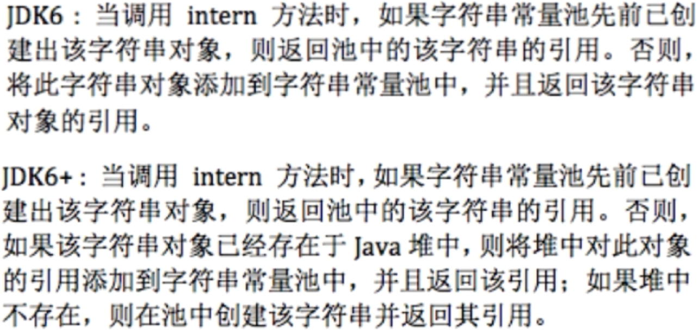

==区别:从原来的把堆中复制到常量池到现在的传引用到常量池==

测试：

```java
public class InternTest {
    public static void main(String[] args) {
        String s1 = new String("a");//存堆中
        s1.intern();
        String s2="a";
        System.out.println(s1==s2);

        String s3=new String("a")+new String("a");//堆中
        s3.intern();
        String s4 = "aa";//常量池中
        System.out.println(s3==s4);
    }
}
```

**常量池的结论**

1.直接字符串变量的时候赋值，如果表达式右边只有字符串常量，那么放在常量池中；

2.new出来的字符串放在堆中

3.对字符串进行拼接操作，也就是做"+"运算的时候，分2种情况：

　　　　　　i.表达式右边是纯字符串常量，那么存放在栈里面。

　　　　　　ii.表达式右边如果存在字符串引用，也就是字符串对象的句柄，那么就存放在堆里面。

运行结果

jdk6：false，false

jdk8：false，true

### 10.验证JDK6，7，8中常量池位置变化，以及PermGen Space变化例子

==原理：不断往常量池添加自字符串，并且调整 -XX:MaxPermSize  -XX:PermSize参数==

```java
public class PermGenError {
    public static void main(String[] args) {
        for(int i=0; i <= 1000; i++){
            //将返回的随机字符串添加到字符串常量池中
            getRandomString(1000000).intern();
        }
        System.out.println("Mission Complete!");
    }
    //返回指定长度的随机字符串
    private static String getRandomString(int length) {
        //字符串源
        String str="abcdefghijklmnopqrstuvwxyzABCDEFGHIJKLMNOPQRSTUVWXYZ0123456789";
        Random random = new Random();
        StringBuffer sb = new StringBuffer();
        for ( int i = 0; i < length; i++){
            int number = random.nextInt(62);
            sb.append(str.charAt(number));
        }
        return sb.toString();
    }
}
```

 以上代码，在jdk=6， -XX:MaxPermSize=5m -XX:PermSize=5m时，运行结果：

```java
Exception in thread "main" java.lang.OutOfMemoryError: PermGen space
	at java.lang.String.intern(Native Method)
	at jvm.PermGenError.main(PermGenError.java:13)
```

==证明：常量池在在PermGen中==

jdk=7， -XX:MaxPermSize=5m -XX:PermSize=5m时，运行结果：

```java
Mission Complete!
```

==说明:常量池从永久代移到了heap堆中==

jdk=8，

```java
Mission Complete!
Java HotSpot(TM) 64-Bit Server VM warning: ignoring option MaxPermSize=5m; support was removed in 8.0
Java HotSpot(TM) 64-Bit Server VM warning: ignoring option PermSize=5m; support was removed in 8.0
```

==说明:永久代被移除！==

==结论：jdk6，常量池在永久代中;在JDK7中，常量池从PermGen Space移动到堆中;在JDK8中jvm移除了PermGen Pace。==

### 11.String a ="aa"与String a = new String("aa")之间的区别

String a = “aa”;这句话执行过程是：

到常量池中寻找“aa”,

1.如果存在，则直接将“aa”对象的地址传递给a;

2.如果不存在，则在常量池中创建“aa”,然后将地址传递给a；

String a = new String(“aa”);执行过程是：

首先在堆内存中创建对象“aa”,

然后在常量池中寻找“aa”,

1.如果存在，啥事不做；

2.如果不存在，在常量池中创建“aa”对象；

总结结可见；直接赋值形式的新建string对象是从常量池中拿数据；最多创建一个string对象，最少创建0个string对象；new形式新建string对象无论怎样会首先在堆内存中创建一个string对象，然后确保常量池中也有一个相同内容的string对象；最多创建2个，最少创建1个。

==由于直接赋值方式可能节约内存，推荐使用该方式==

1.程序计数器作用

比如老王正在看电影，他看到三十五分钟的时候，突然他的QQ好友给他开视频聊天，这时候肯定打断他看电影了，假设他qq好友和他视频完了，他肯定要接着他那35分钟的进度去继续看，这时候他怎么知道我看到35分钟了？这时候程序计数器就起了作用，他负责管理进度。

又比如A线程正在执行HelloWorld.class的第三十五行。这时候CPU时间片被B线程抢走了，当A线程重新被分配到时间片时，他怎么知道我的class运行到哪了？这时候他可以看程序计数器在哪个位置。

https://www.cnblogs.com/thiaoqueen/p/8455521.html

### 12.方法区和直接内存什么时候会OOM

有哪些可能溢出：

堆溢出：不断创建实例或者实例无法回收

栈溢出：StackOverflowError，OutOfMemoryError

方法区（运行时常量池）：

运行时产生大量的类，如使用CGLIB动态产生大量的类填满方法区

直接内存：

NIO

### 13.说一下对象的内存布局（对象在内存中的结构）

#### **13.1.对象头**

MarkWord

类型指针

#### **13.2.实例数据**

#### **13.3.填充数据**

（不是必须，因为虚拟机要求对象大小是8字节的倍数，对象头刚好是8字节，也就是当实例数据部分没有对齐时，则使用填充数据来填充）

==需要注意的是:数组的内存结构和普通对象的内存结构不同，数组有一个长度length字段，所以在对象后面还多了一个int类型的length字段，占4个字节，接下来才是数组中的数据==

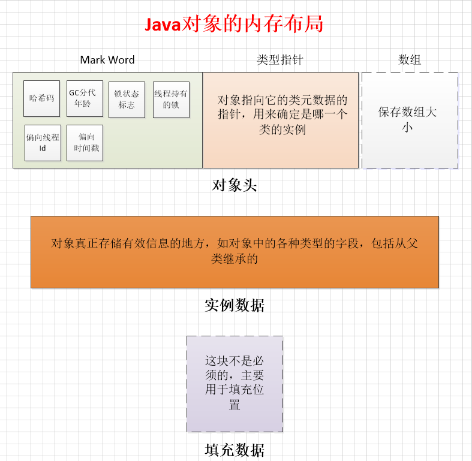

#### 13.4.普通对象的内存结构

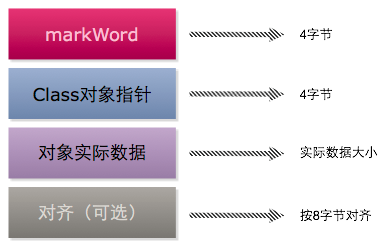

延申：32位机器下，Integer对象是int大小的几倍?

int是4个字节，Integer是16个，所以是4倍

### 14.说一下对象的创建过程，怎么分配内存的，分配规则是什么

#### **14.1.对象创建过程**

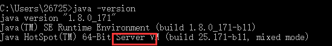

#### **14.2.分配内存**

（1）**指针碰撞**:假设java堆中内存是绝对规整的，所有用过的内存都放在一边，空闲的内存放在另一边，中间放着一个指针作为分界点的指示器，那所分配内存就仅仅是把那个指针向空闲空间那边挪动一段与对象大小相等的距离，这种分配方式称为“指针碰撞”（Bump the Pointer）

由于堆空间是线程共享的，所以该方式存在着并发问题，通常有以下两种解决方案：

​           \1. 对内存分配的动作进行同步处理；

​           \2. 本地线程分配缓冲（LTAB）。

​           \### 999本地线程分配缓冲：将内存按照分配的动作按线程划分在不同的空间进行，即每个线程在Java堆中预先申请一块内存(LTAB)，哪个线程需要分配空间，就在哪个线程的LTAB上执行。只有当某一线程的LTAB用完了才执行同步锁定。

（2）**空闲列表：**如果Java堆中的内存并不是规整的，已使用的内存和空闲的内存相互交错，那就没有办法简单地进行指针碰撞了，虚拟机就必须维护一个列表，记录上哪些内存块是可用的，在分配的时候从列表中找到一块足够大的空间划分给对象实例，并更新列表上的记录

（3）**TLAB**

#### **14.3.分配规则：**

（1）小对象，优先分配在Eden区，当Eden区没有足够空间时，进行一次Minior GC

（2）大对象，如很长的字符串或者数组，直接放入老年代

（3）小对象，如果开启了TLAB，则按线程优先在TLAB上分配

#### **14.4.对象分配流程：**


#### 14.5.对象的访问定位

1.直接指针（Java常用的虚拟机HotSpot使用直接指针）

好处：速度更快，省去一次指针定位的操作

  


2.使用句柄

java堆中将划分出一块内存做为句柄池，reference中存放的就是对象的句柄地址，句柄中包含了对象实例数据和对象类型数据的具体地址信息。实际上是使用句柄池这样的一个中间介质进行了两次定位，避免了对象的移动或者改变导致reference改变

好处：reference中存的是稳定的句柄地址，对象移动（如垃圾回收），只需要改变句柄中实例数据指针，而reference不需要改变


### 15.java.lang.Class对象是放在堆中的吗，有什么作用（JDK1.7）

没有放在堆中，是放在方法区的。作为方法区这个类的各种数据访问入口

### 16.怎样确定类和方法在java虚拟机中的唯一性

1. 1.类：类加载器+全限命名

1. 2.方法：描述符+简单名称+类的全限命名，组成了符号引用，可以确定方法的唯一性

   描述符：(Ljava/lang/String[CIIC)I 

   简单名称：get()

   类的全限命名：com.test.Student

### 17.什么是Java内存模型（注意与Java内存结构区分）

​	描述:JMM(Java Memeory Model)是和多线程相关的，他描述了一组规则或规范，这个规范定义了一个线程对共享变量的写入时对另一个线程是可见的。

1.Java内存模型的主要目标: 定义程序中各个变量的访问规则。

2.JMM规定了所有的变量都存储在主内存（Main Memory）中。每个线程还有自己的工作内存（Working Memory）,线程的工作内存中保存了该线程使用到的变量的主内存的副本拷贝，线程对变量的所有操作（读取、赋值等）都必须在工作内存中进行，而不能直接读写主内存中的变量（volatile变量仍然有工作内存的拷贝，但是由于它特殊的操作顺序性规定，所以看起来如同直接在主内存中读写访问一般）。不同的线程之间也无法直接访问对方工作内存中的变量，线程之间值的传递都需要通过主内存来完成。


3.Java内存模型围绕着原子性，可见性，有序性这三个特征来建立的，其中原子性（Java中基本数据类型大都是原子操作，long和double是64位，但是在32位的JVM中，jvm会将64位数据的读写操作分为2次32位的读写操作来进行，这就导致了long、double类型的变量在32位虚拟机中是非原子操作，数据有可能会被破坏，也就意味着多个线程在并发访问的时候是线程非安全的）

（原子性：一个或某几个操作只能在一个线程执行完之后，另一个线程才能开始执行该操作，也就是说这些操作是不可分割的，线程不能在这些操作上交替执行。如果64位两次操作的话，其中可能插入其它线程，所以操作不是原子操作）

### 18.Java虚拟机的工作模式

1.server模式运行：性能提升很大，尤其是method call，但是启动速度较慢

2.client模式运行：性能一般，启动速度快

java -version查看当前虚拟机运行模式

