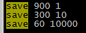
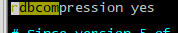
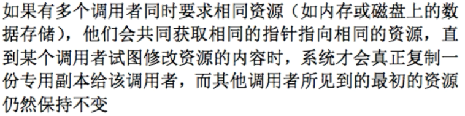
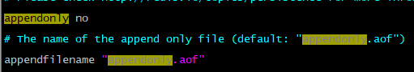
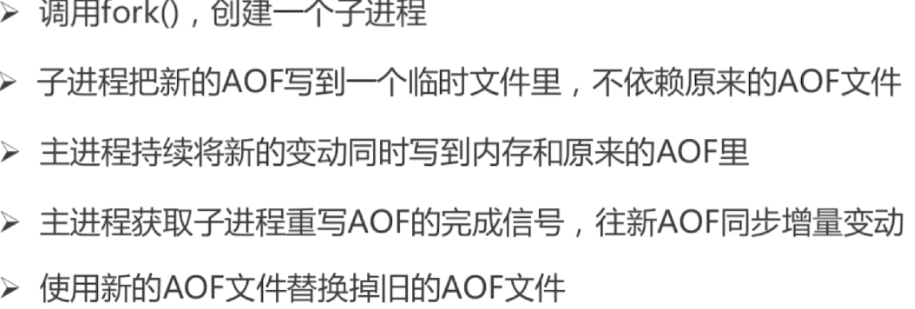
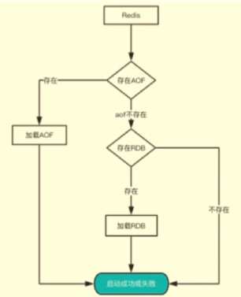
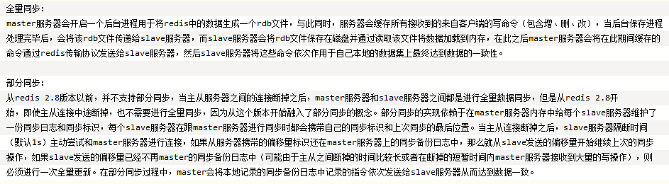

### 1.redis和memcache的区别

#### **1.1 memcache：代码层面类似hash**

​	支持简单数据类型；不支持数据持久化存储；不支持主从；不支持分片

#### **1.2redis**

​	数据类型丰富；支持持久化；支持主从；支持分片

### 2.redis为什么这么快？


### 5种IO模型?

https://blog.csdn.net/qq_34638435/article/details/81878301

### 3.说说你用过的数据类型?

1. String:最大512m：put
2. hash：常用于存储对象：hput
3. list：类似栈，按照String元素插入的顺序排序：lpush
4. set：String元素组成的无序集合，通过哈希表实现，不允许重复。（Redis 中的集合是一个字符串类型的无序集合，即集合中不存在重复的元素。集合中最大的元素个数为 2^32 -1 个，集合内部的操作是基于哈希表实现的，一次添加、查找、删除操作的时间复杂度都为 O(1)）
5. sadd  key members
6. sort set：通过分数为集合中 的成员从小到大排序。	zadd

### 4.底层的数据类型基础

1. 简单动态字符串
2. 链表
3. 字典
4. 跳跃表
5. 整数集合
6. 压缩列表
7. 对象

### 5.如何从海量数据里查询某一固定前缀的key

1. **keys pattern**

2. 1. 格式:keys  zql*
   2. 特点：keysz指令可以一次性返回所有匹配的key，健的数量过大会导致服务卡顿

3. **scan cursor**

4. 1. 格式:scan  0  MATCH aaa*  COUNT  5 表示游标从0开始查询aaa开头的key，每次返回5条，但是不一定是5条。
   2. 特点：


### 6.如何通过redis实现分布式锁以及缺点?zookeeper分布式锁?

https://mp.weixin.qq.com/s/ODbju9fjB5QFEN8IIYp__A

分布式锁需要解决的问题：互斥性，安全性，死锁，容错

1. **简单的判断锁**

2. 1. 在获取锁之前检查以该线程taskid为key对应的value存不存在，如果存在，则代表锁已经被获取了。否则，就尝试获取该锁，获取锁只需要以taskid为key，设置一个随机数位value。
   2. 指令选择：setnx key value：如果key不存在，则创建并赋值；时间复杂度为O(1)；成功返回1，失败返回0.
   3. 缺点:如果在获取锁后，执行的业务的时候突然中断（比如宕机），那么锁不会被释放。

3. **设置失效时间**

4. 1. 指令：

   2. 1. 设置失效时间 Expire  缺点:不是原子操作

      2. 原子操作：set key value 【ex seconds】【px milliseconds】 【nx|xx】

      3. 1. ex设置参数时间，单位为s
         2. px设置参数时间，单位为毫秒
         3. nx表示当key不存在时才执行相应操作
         4. xx表示指定key存在时执行响应操作

   3. 缺点：如果我失效时间设置为3s，我业务执行了4s。那么可能导致该锁被其他线程获取到，后面执行锁的释放操作释放的是其他线程的锁

5. **对比value**

6. 1. 由于在前面我们以taskid位key，随机数为value，为了防止上面的情况，在释放锁的时候，不是直接删除value，对比一下value是否等于先前设置的值。
   2. 缺点：由于在在上面的过程中，操作不是原子性的。可能在对比完后，锁被其它线程获取，此时也有可能释放的是其它线程的锁

7. **使用lua脚本使3的过程成为原子操作。**

### 7.使用redis做异步队列

#### 7.1利用list作为队列 ，rpush 生产消息，lpop消费消息。

缺点：没有等待队列有值就直接消费。可以在应用层引入sleep重试调用lpop

生产：rpush testlist  aaa；消费：lpop testlist

或者blpop key timeout 阻塞队列有消息或者超时。

blpop testlist 300 等待300s

缺点：一对一消费

#### 7.2.pub/sub:主题订阅模式，pub发送消息，sub消费消息

publish test 'i love you'

subscribe test  多个同时监听

缺点：消息是无状态的，无法保证可达性。使用专业的消息中间件

### 8.RDB持久化

#### **8.1 RDB快照持久化，保存某个时间点的全量数据快照**

save：阻塞redis服务的主进程，直到rdb数据文件被创建完毕

bgsave：从主进程中fork一个进程出来创建rdb文件，不会阻塞主进程

lastsave：查看上次执行备份的时间



配置规则：

1. 900s内有1条写入就快照
2. 300s内10条
3. 60s内10000条


当备份进程出错，主进程就停止写入



是否压缩rdb数据后保存，建议不要压缩

#### **8.2自动触发持久化rdb的方式**

1. 根据redis.conf配置save m n定时触发 （是bgsave）
2. 主从 复制时，主节点自动触发
3. 执行debug reload
4. 执行shutdown且没有开启aof持久化

#### **8.3 bgsave原理**

系统调用fork():创建进程，实现了COW

copy-on-write



### 9.AOF持久化

#### **9.1 append-only-file持久化，保存写的状态**

1. 记录除查询以外的所有变更数据库的指令。
2. 以append的形式追加保存到AOF文件中（增量保存）

#### **9.2开启aof持久化以及默认的aof文件名**



**保存方式**


- always:内存中只要有变化就写入aof文件中
- everysec：每隔一秒
- no

#### **9.3日志重写解决aof文件不断增大的问题？**



### 10.数据恢复流程：重启



### 11，rdb和aof的优缺点？


### 12.持久化优化？

rdb-aof混合持久化

### 13.redis的同步机制

全同步

增量同步

哨兵模式

### 14.redis集群原理

### ==### 面试题-------------------==

### 1.redis事务以及watch功能？

#### **1.1 事务的定义**

redis事务是一组命令的集合，和命令一样是最小的执行单位。原理是将一组属于事务的远离发送给redis，并依次执行。由于redis不能回滚，故redis事务并不是原子操作

#### **1.2 事务的错误处理**

#### **1.3命令错误**

```java
127.0.0.1:6379> set a a
QUEUED
127.0.0.1:6379> set  b  b
QUEUED
127.0.0.1:6379> set c
(error) ERR wrong number of arguments for 'set' command
127.0.0.1:6379> exec
(error) EXECABORT Transaction discarded because of previous errors.
127.0.0.1:6379> 
```

跟在multi后面执行了4个命令，前面2个命令都是正确命令，只要有一个语法错误，执行exech后redis就会直接返错误，连正确的也不执行（错误命令后面的正确命令不执行）

#### **1.4 运行错误**

```java
redis＞MULTI
OK
redis＞SET key value
QUEUED
redis＞SET key
(error)ERR wrong number of arguments for 'set' command
redis＞ errorCOMMAND key
(error) ERR unknown command 'errorCOMMAND'
redis＞ EXEC
(error) EXECABORT Transaction discarded because of previous errors.
```

运行错误指在命令执行时出现的错误，比如使用散列类型的命令操作集合类型的键，这种错误在实际执行之前Redis是无法发现的，所以在事务里这样的命令是会被Redis接受并执行的（可以添加到队列）。如果事务里的一条命令出现了运行错误，事务里其他的命令依然会继续执行（包括出错命令之后的命令）

#### **1.5 watch**

```java
watch key1 key2
```

watch可以监控一个或者多个健，一旦有一个键被修改或者删除，之后的事务就不会执行了。监控一直持续到exec命令。事务中的命令是再exec执行之后才执行的，所以mult命令后可以修改watch的键值监控。

#### **1.6 unwatch**

#### **1.7 取消监控**

### 2.redis的并发竞争问题如何解决？

https://www.cnblogs.com/shamo89/p/8385390.html

原因：多线程环境下线程不安全

1.  利用redis自带的incr命令
2.  可以使用独占锁的方式，类似操作系统的mutex机制. 不过实现相对复杂，成本较高
3. 使用乐观锁的方式（成本较低，非阻塞，性能不错）
4. .客户端加锁（java代码里面加锁）

### 3.redis的缓存失效策略

当缓存需要被清理时（比如空间占用已经接近临界值了），需要使用某种淘汰算法来决定清理掉哪些数据。常用的淘汰算法有下面几种：

1. FIFO：First In First Out，先进先出。判断被存储的时间，离目前最远的数据优先被淘汰。
2. LRU：Least Recently Used，最近最少使用。判断最近被使用的时间，目前最远的数据优先被淘汰。
3. LFU：Least Frequently Used，最不经常使用。在一段时间内，数据被使用次数最少的，优先被淘汰。

#### 4.redis集群，高可用原理

#### 5.使用过redis做异步队列吗，是怎么做的，有什么缺点？

1.利用list作为队列 ，rpush 生产消息，lpop消费消息。

缺点：没有等待队列有值就直接消费。可以在应用层引入sleep重试调用lpop

生产：rpush testlist  aaa；消费：lpop testlist

或者blpop key timeout 阻塞队列有消息或者超时。

blpop testlist 300 等待300s

缺点：一对一消费

2.pub/sub:主题订阅模式，pub发送消息，sub消费消息

publish test 'i love you'

subscribe test  多个同时监听

缺点：消息是无状态的，无法保证可达性。建议使用专业的消息中间件

#### 6.redis集群的最大节点数是多少

https://www.jianshu.com/p/de268f62f99b

Redis 集群并没有使用一致性hash，而是引入了哈希槽的概念。Redis 集群有16384个哈希槽，每个key通过CRC16校验后对16384取模来决定放置哪个槽，集群的每个节点负责一部分hash槽。所以最大节点数也是16484。

一致性hashhttps://mp.weixin.qq.com/s/yimfkNYF_tIJJqUIzV7TFA

#### 7.redis如何解决key冲突

####     **7.1.业务隔离**

​    使用不同的redis或者db

####7. 2.良好的redis key设计

​    如使用user:session:login这样的key

### 8.redis主从复制原理 



同步策略

主从刚刚连接的时候，进行全量同步；全同步结束后，进行增量同步。当然，如果有需要，slave 在任何时候都可以发起全量同步。redis 策略是，无论如何，首先会尝试进行增量同步，如不成功，要求从机进行全量同步。

https://www.cnblogs.com/kevingrace/p/5685332.html

https://blog.csdn.net/fst438060684/article/details/80958375