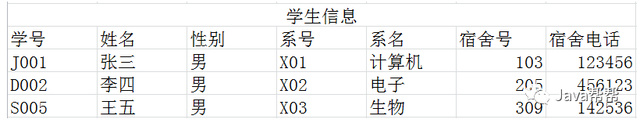

1.sql调优

### **1.如何定位并查询优化慢sql**

根据慢日志定位慢sql

1.打开慢日志，获取慢sql

**show VARIABLES LIKE '%quer%‘**	--修改slow_query_log=ON，long_query_time=‘自定义’，slow_query_log_file=慢日志路径

**show STATUS LIKE '%slow_queries%'**  --统计本次会话慢sql的条数

使用explain等工具分析慢sql

**type**  index>all  --如果出现这两个，则代表全表扫描

**extra** 出现以下2项则代表mysql根本不能使用索引

using filesort 

using temporary  表示mmysql在对查询结果排序时使用临时表，常见于order by 和分组查询group by

修改sql或者尽量让sql走索引

测试索引的速度：select COUNT(article_id)  from wechat_article force index (PRIMARY)

ke模糊查询的时候，值得**左边不可以有****%**

### 面试题---------------------------

### 1.mysql中左连接和右连接区别

如现在有两个表books，articls表

**左连接：**

select * from books a left join articls b on a.title=b.title

**右连接：**

select * from books a right join articls b on a.title=b.title

**内连接：**

select * from books a inner join articls b on a.title=b.title

### **2.数据库第一二三范式？**

#### **2.1.第一范式（列不能再分割）**

==指的是创建表的时候，数据列不能再分割==

如，创建一个职员表create table staffs(

name varchar(2) primary key,

age number(10) not null,

contact varchar2(20)

)

这里的contact就不符合第一范式，因为联系方式有多种，如电话，mail，qq等，还可以继续分割

#### **2.2.第二范式（多对多，如一个老师可以教多个班，一个班可以有多个老师）**

==指的是列与列之间不存在函数依赖关系，第二范式是部分依赖，即表中的非主键字段，都要依赖主键。==

如，创建一个商品表create table goods(

name varchar2(20) primary key,

price number(10),

num number(10),

price_count number(10)

)

这里的总价price_count=单价price*数量num，所以不符合第二范式

#### **2.3.第三范式（一对多，如一个学校可以有多个学生，但是一个学生只能有一个学校）**

==不存在依赖关系，即不能传递依赖，非主键字段不能有从属关系（宿舍号，宿舍电话依赖学生）==

如一个学生表。

这样一张表中则存在着传递依赖。也就是系名依赖系号，系号依赖学号，那么间接的系名依赖学号，宿舍号、宿舍电话和学号之间也有同样的关系。如要修改系名的时候，就要修改多张表，十分冗余