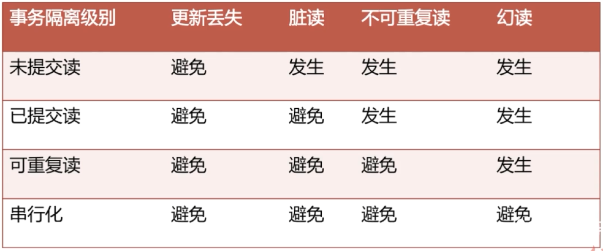

### 1.数据库事务的4大特性ACID

原子性 Atomicity：要么全做要么全部回滚

一致性 Consistency：如转账

==隔离性== Isolation：事务之间互不影响

持久性 Durability：持久化，比如重启数据库后数据还在

### 2.数据库并发可能导致的数据问题？

更新丢失：A事务更新到B事务未提交的数据

脏读：A事务读到B事务未提交的数据，导致脏读。

不可重复读:在A事务多次读取数据的过程中，读到的数据不一样（读到另一个事务提交的数据）

幻读：在A事务对数据做修改过程中，B事务修改了数据并提交。如果这时A事务再去查看刚刚修改的数据（select）会发现数据没修改一样，就像出现了幻觉

==幻读和不可重复读的异同：==

==都是读取到其它事务提交的数据，不同的是不可重复度读取 到的是同一个数据，幻读是读取的一般是一批数据（比上一次读取到得多）==

测试sql：

select @@tx_isolation #查询事务级别

set session transaction ISOLATION LEVEL READ COMMITTED#读未提交

start TRANSACTION

select money from innodb_table where id=1;

UPDATE innodb_table set money =1000-100;

ROLLBACK;#发生异常时回滚

### 3.数据库的隔离级别 

READ UNCOMMITTED 

READ COMMITTED	#Oracle默认的隔离级别

READ REPEATABLE-READ	#Innodb的默认隔离级别

SERIALIZABLE：串行化

### 4.隔离级别解决的数据问题

### 面试题--------------------------

### 1.说一下mysql中的事务隔离实现技术

1. MVCC(原理在锁模块)

   mvcc的优势是不加锁，并发性高。缺点是不是实时数据。

   读的是快照数据，通过读取历史数据解决幻读。

2. next-key（原理在锁模块）

   优势是获取实时数据，但是需要加锁。

   加上gap锁和record锁，锁住1+2的区间，其它事务不能修改，所以并发不高。

### 2.mysql数据库隔离级别，通过什么实现的，每个级别解决什么问题

[**https://blog.csdn.net/chenyiminnanjing/article/details/82714341**](https://blog.csdn.net/chenyiminnanjing/article/details/82714341)

#### ==2.1 脏读==

==指一个事务在处理过程中读取了另外一个事务未提交的数据。如：小明账户account有100块钱，T1修改为200，但未提交。T2读取的时候，就是200，这个时候T1在回滚的话，那么T2就产生脏读，读取了一个"不存在"的数据==

#### ==2.2.不可重复读==

==T1读取了一个数据，T2立马修改，T1再次读取的时候得到不同结果，发生不可重复读。在一些情况下不可重复读不是问题。但是如果对于同一个数据A和B依次查询就可能不同，A和B就可能打起来。==

#### ==2.3.幻读（虚读）==

==事务T1对一个表中所有的行的某个数据项做了从“1”修改为“2”的操作，这时事务T2又对这个表中插入了一行数据项，而这个数据项的数值还是为“1”并且提交给数据库。而操作事务T1的用户如果再查看刚刚修改的数据，会发现还有一行没有修改，其实这行是从事务T2中添加的，就好像产生幻觉一样，这就是发生了幻读。==

#### ==2.4.三者区别==

==脏读是读取了另外一个事务未提交的数据。==

==不可重复读是读取了另外一个事务提交的数据。==

==幻读和不可重复读一样，都是读取了另外一个事务提交的数据。不同的是不可重复读查询的都是同一个数据，幻读是针对的一批数据==

现在来看看MySQL数据库为我们提供的四种隔离级别：

　　① Serializable (串行化)：可避免脏读、不可重复读、幻读的发生。

　　==**② Repeatable read (可重复读)：可避免脏读、不可重复读的发生。通过MVCC实现**==

　　③ Read committed (读已提交)：可避免脏读的发生。

　　④ Read uncommitted (读未提交)：最低级别，任何情况都无法保证。

以上四种隔离级别最高的是Serializable级别，最低的是Read uncommitted级别，当然级别越高，执行效率就越低。像Serializable这样的级别，就是以锁表的方式(类似于Java多线程中的锁)使得其他的线程只能在锁外等待，所以平时选用何种隔离级别应该根据实际情况。在MySQL数据库中默认的隔离级别为Repeatable read (可重复读)。

　　在MySQL数据库中，支持上面四种隔离级别，默认的为Repeatable read (可重复读)；而在Oracle数据库中，只支持Serializable (串行化)级别和Read committed (读已提交)这两种级别，其中默认的为Read committed级别。

　　在MySQL数据库中查看当前事务的隔离级别：

   	==select @@tx_isolation;==