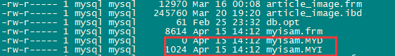
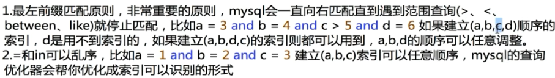

### 1.索引的数据结构

[https://mp.weixin.qq.com/s__biz=MzIxNTQ3NDMzMw==&mid=2247483701&idx=1&sn=bd229dd584f51ef4fe545d44ad8cdbf9&chksm=979688c7a0e101d1b5c752094013b78f5bd50ab905257ba82149d85d35ea07aba1a15b0e52b4#rd](https://mp.weixin.qq.com/s?__biz=MzIxNTQ3NDMzMw==&mid=2247483701&idx=1&sn=bd229dd584f51ef4fe545d44ad8cdbf9&chksm=979688c7a0e101d1b5c752094013b78f5bd50ab905257ba82149d85d35ea07aba1a15b0e52b4#rd)

#### **1.1 二叉树查找**

使用二分查找，时间复杂度为O(logn)。

#### **1.2 B-Tree**

https://www.cnblogs.com/mysql-dba/p/6689597.html

##### **1.2.1 定义**：

1. 树的每个节点最多有m个子节点
2. 根节点不是叶子节点，则至少有2个子节点
3. 除根节点外的所有非叶子节点，至少有ceil(m/2)个子节点
4. 父结点下的最左边子树所有结点的值均小于父结点最小值；最右边子树所有结点的值均大于父结点最大值；其余中间子树所有结点的值则介于指针的父结点两边的值;
5. 所有的叶子节点都在同一层

##### **1.2.2 特点**

1. 根结点的孩子数>=2(前提是树高度大于1)
2. 除根结点与叶子结点，其他结点的孩子数为[ceil(m/2),m]个。ceil函数表示上取整数
3. 所有叶子结点都出现在同一层，叶子结点不存储数据。
4. 各个结点包含n个关键字信息：(P0,K1,P1,K2,P2......Kn,Pn)

   其中：        

1. Ki(i=1,2......n)为关键字，且K(i-1)<Ki，即从小到大排序 
2. 关键字的个数n必须满足：[ceil(m/2)-1,m-1]。如一个5阶B-tree，每个节点的关键字个数为[2,4] 
3. Pi指向子树，且指针P(i-1)所指向的子树结点中所有关键字均小于Ki。即：父结点中任何关键字的左孩子都小于它，右孩子大于它。

##### **1.2.3 B树的插入**

1）插入新元素，如果叶子结点空间足够，则插入其中，遵循从小到大排序；

2）如果该结点空间满了，进行分裂。将该结点中一半关键字分裂到新结点中，中间关键字上移到父结点中。

例子：将下面数字插入到一棵5阶B-Tree中：[3,14,7,1,8,5,11,17,13,6,23,12,20,26,4,16,18,24,25,19]

先按照[ceil(m/2)-1,m-1]  =[2,4]得出关键字范围

需要分裂6次才能形成一颗B树。

#### **1.3 B+Tree**

##### 1.3.1 特点

1.  ==非叶子结点的子树指针与关键字个数相同；==
2.  ==非叶子节点的子树指针P[i]，指向关键字值[K[i],K[i+1])的子树，如K[10]指向的值小于K[20]的值，其中"[K[i]"不是必须，也可以取18作为关键字。==
3. ==所有叶子结点通过一个链指针相连；==
4. ==非叶子节点仅用来做索引，数据都保存在叶子节点中==

 

##### **1.3.2 插入策略**

对于递增/递减索引插入操作：

1、插入新元素，判断叶子结点空间是否足够，如果足够，直接插入

2、如果叶子结点空间满了，判断父结点空间是否足够，如果足够，将该新元素插入到父结点中；如果父结点空间满了，则进行分裂。

优化后的分裂策略仅仅针对递增/递减情况，显著的减少了分裂次数并且大大提高了索引页面空间的利用率。

如果是随机插入，可能会引起更高代价的分裂概率。所以InnoDB存储引擎会为每个索引页维护一个上次插入的位置变量，以及上次插入是递增/递减的标识。InnoDB能够根据这些信息判断新插入数据是否满足递增/递减条件，若满足，则采用改进后的分裂策略；若不满足，则进行50%的分裂策略。

**1.3.3 B+树的优点**

磁盘读写代价更低--节点可以容纳更多关键字，所以读入内存中的关键字可以更多，减少io

查询效率更加稳定--无论查询哪个数据，都需要从根节点查询到叶子节点

更有利于对数据库的扫描--数据都保存在叶子节点中，所有的叶子节点都由链指针相连，可以找到其他数据

#### **1.4 Hash**

hash索引示意图

1. （hash index）基于哈希表实现，只有精确匹配到索引列的查询，才会起到效果。对于每一行数据，存储引擎都会对所有的索引列计算出一个哈希码（hash code）,哈希码是一个较小的整数值，并且不同键值的行计算出来的哈希码也不一样。
2. 哈希冲突：不同的值得到了相同的哈希码，例如f('tao')=2323 f('wang')=2323,此时就是出现了哈希冲突
3. 当出现哈希冲突时，相同的数据会存储在链表中，**遍历**链表找到符合的。

### **2.稀疏索引和密集索引**

密集索引文件中每个搜索码值都对应一个索引值。即叶子节点不仅仅保存的是键值，还保存了位于同一行的其它列信息，密集索引决定了表的物理排列顺序，一个表只能有一个物理排列顺序，所以一个表只能有一个密集索引

稀疏索引文件只为索引码的某些值建立索引项。即叶子节点仅保存了键值信息以及该行信息的地址

#### **2.1 Innodb的聚簇索引结构**

若一个主键被定义，该主键则被作为密集索引

若没有主键被定义，该表的第一个唯一非空索引作为密集索引

若不满足以上条件，innodb内部会生成一个隐藏主键（密集索引）

非主键索引存储相关键位和对应的主键值，包含2次查找。即以非主键查询时，会生成一个辅助键索引（二级索引），该索引的叶子节点只包含该列值和主键值（如：Jobs-11），找到主键值=11后，再去编理主键索引，这个过程被称为==回表==，如下图

由图片我们可以看到，主键索引直接通过主键值找到该行数据，因为innodb的主键值和该行信息保存在一起

创建一个innodb类型的空表

由图我们可以看到innodb的数据和索引都保存在同一个文件中

#### **2.2 Myisam的稀疏索引结构**

叶子节点中只存储了该行数据的地址

 

创建一个myisam类型的空表，我们可以看到有.myd和.myi两个文件，.myi保存的是索引信息，.myd保存的是数据信息。向myisam表添加数据后，myisam.myd不为0了。

 

### 2.存储引擎

什么是存储引擎？

MySQL中的数据用各种不同的技术存储在文件(或者内存)中。这些技术中的每一种技术都使用不同的存储机制、索引技巧、锁定水平并且最终提供广泛的不同的功能和能力。通过选择不同的技术，你能够获得额外的速度或者功能，从而改善你的应用的整体功能。**这些不同的技术以及配套的相关功能在 MySQL中被称作存储引擎(也称作表类型)。**

**innodb引擎**

**MyIsam引擎**

### ==面试题----------==

### **1.索引的应用场景**

1.   当数据多且字段值有相同的值得时候用普通索引。
2.  当字段多且字段值没有重复的时候用唯一索引。
3. 当有多个字段名都经常被查询的话用复合索引。
4. 普通索引不支持空值，唯一索引支持空值。
5. 若是这张表增删改多而查询较少的话，就不要创建索引了，因为如果你给一列创建了索引，那么对该列进行增删改的时候，都会先访问这一列的索引，若是增，则在这一列的索引内以新填入的这个字段名的值为名创建索引的子集，若是改，则会把原来的删掉，再添入一个以这个字段名的新值为名创建索引的子集，.若是删，则会把索引中以这个字段为名的索引的子集删掉。所以，会对增删改的执行减缓速度，所以，若是这张表增删改多而查询较少的话，就不要创建索引了。 更新太频繁地字段不适合创建索引。
6. 不会出现在where条件中的字段不该建立索引，建了用不到。

### 2.为什么加索引比不加索引快，完全是这样吗

**索引的优点：**

1.大大减少服务器需要扫描的数据量

2.将随机I/O变为顺序I/O，避免多次随机I/O的多次磁盘寻道

3.可以帮助服务器避免排序和临时表

**完全是这样吗？**

不是，对于重复数据很多的列建立索引，因为过滤后数据量也很大，所以会先走索引再回表，所以很慢

### 3.mysql（mariadb）中的索引

#### **3.1.前缀索引**

 https://blog.csdn.net/john1337/article/details/71081827

就是对字符串前几个字符建立索引，这样索引更小，提高索引的速度。缺点是不能在order by和group by中使用前缀索引，也不能把它们作为覆盖索。引对于BLOB，TEXT，或者很长的VARCHAR类型的列，必须使用前缀索引，因为MySQL不允许索引这些列的完整长度。

#### **3.2.索引合并**

https://www.cnblogs.com/zhuifeng-mayi/p/9291503.html

我们的 where 中可能有多个条件(或者join)涉及到多个字段，它们之间进行 AND 或者 OR，那么此时就有可能会使用到 index merge 技术。index merge 技术如果简单的说，其实就是：**对多个索引分别进行条件扫描，然后将它们各自的结果进行合并(intersect(交集)/union/sort union)**。

#### **3.3.聚簇索引

（**如果能充分利用聚簇索引有点，能极大提高性能。如果设计不好，也能大幅度降低性能**）

（1）聚簇索引并非一种单独的索引，而是一种数据存储方式。InnoDB的聚簇索引实际上是在同一个结构中保存了B-Tree索引和数据行。聚簇索引的叶节点就是数据节点

（2）聚簇索引的顺序就是数据的物理存储顺序，所以一个表最多只能有一个聚簇索引

#### **3.4.非聚簇索引**

（1）非聚簇索引的页节点仍然是索引检点，指向行的主键值（而不是指向行的物理位置）

（2）索引顺序与数据物理排列顺序无关

#### **3.5.组合索引（**窄索引，宽索引**）**

**如（a,b,c）实际相当于创建了(a)，（a,b），（a,b,c）三个索引**

窄索引：1-2列的索引

宽索引：2列以上的索引

设计索引的一个重要原则就是能用窄索引不用宽索引,因为窄索引往往比组合索引更有效;

优点：所需开销更小，节约空间和时间

#### **3.6.B树索引/B+树索引**

#### **3.7.哈希索引**

#### **3.8.覆盖索引（**能极大的提高性能**）**

https://blog.csdn.net/jh993627471/article/details/79421363

如组合索引(a,b,c)：

如果一个索引包含(或覆盖)所有需要查询的字段的值，称为‘覆盖索引’。即只需扫描索引而无须回表。减少了很多随机I/O操作，减少随机I/O是dba的主要优化策略

和复合索引的区别：

复合索引不一定能覆盖所有的值，覆盖索引可能是复合索引，复合索引也可能是覆盖索引

#### 3.9.压缩（前缀压缩）索引

（**能极大减少索引大小，所以在某些情况下也能极大提高性能**

**--MyIASM**

使用前缀压缩，可以极大的减少索引大小，从而可以让更多的索引放入内存中

#### **3.10.冗余索引**

就是多余的索引，如已经有索引(a,b)，再创建(a)，则(a)索引冗余，因为只是前一个索引的前缀索引

会再维护(a)索引，并且优化器在查询的时候也会逐个进行考虑，影响性能

但是凡是没有绝对，有时候扩展已有索引代价太大，可能就需要建一个冗余索引

**Percona Toolkit工具可以用于排查索引**

### 2.联合索引的最左匹配原则的成因？

####  2.1.规则

https://www.cnblogs.com/lanqi/p/10282279.html

#### ==2.2.原因==

==假设建立（a,b）联合索引，那么建立的B+树是这样的，此时叶子节点中只包含a，b，主键值==

==我们可以发现:a值是有序的1，1，2，2，3，3可以通过a遍历；值是无序的1，2，1，4，1，2。，无法单纯依靠b值遍历，因为b值是无序的。但是在a有序的时候b值又是局部有序（联合B+树生成规则就是这样，a一样的情况下，才对b排序）的如：1，1--1，2，所以当mysql server匹配到范围查询语句后（可以匹配这个范围查询），但是后面的就停止匹配了（后面的是无序的），也就是不能走索引。例如a>1 and b=2,我都是无序的还怎么匹配啊？==

联合索引测试：

select * from innodb_table where sex like '%w%'  走不走索引?

select * from innodb_table where sex like 'w%' 走不走索引？

测试结果：

结论：当给一个字段创建了索引的话，而这个字段要进行like模糊查询的话，那么这个值左边不可以有%，因为索引查询是要从左到右的，你如果给它加上%后，左边的值不是确定的话，它会找不到这个索引。

### 3.说一下B树索引和hash索引区别，为什么hash索引比B树索引快

- **如果是等值查询，那么哈希索引明显有绝对优势**，因为只需要经过一次算法即可找到相应的键值；当然了，这个前提是，键值都是唯一的。如果键值不是唯一的，就需要先找到该键所在位置，然后再根据链表往后扫描，直到找到相应的数据；
- 从示意图中也能看到，**如果是范围查询检索，这时候哈希索引就毫无用武之地了**，因为原先是有序的键值，经过哈希算法后，有可能变成不连续的了，就没办法再利用索引完成范围查询检索；hash仅能满足"=","IN"和"<=>"查询
- 同理，**哈希索引也没办法利用索引完成排序**，以及like ‘xxx%’ 这样的部分模糊查询（这种部分模糊查询，其实本质上也是范围查询）；
- **哈希索引也不支持多列联合索引的最左匹配规则**；==(最左匹配是基于B+树的)==
- B+树索引的关键字检索效率比较平均，不像B树那样波动幅度大，**在有大量重复键值情况下，哈希索引的效率也是极低的，因为存在所谓的哈希碰撞问题（当hash碰撞的时候，相同的数据会被保存在同一个bucket中，形成entry链表，此时只有挨个遍历找出数据）**
- Hash 索引在任何时候都不能避免表扫描。