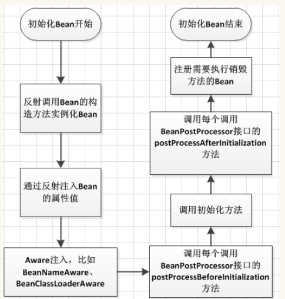
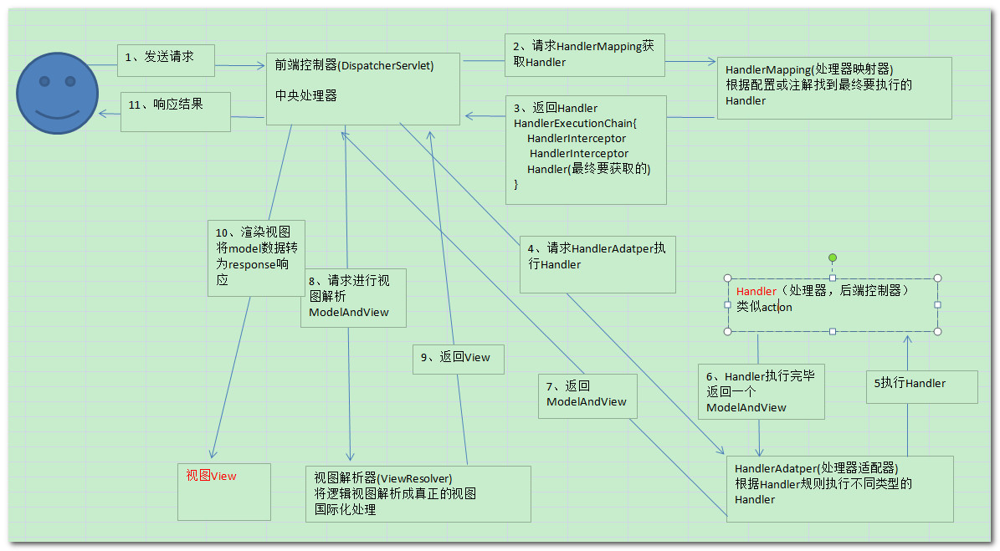

### .依赖注入（DI）

含义：把底层类做为参数传递给上层类，实现上层对下层的控制 

### 2.IOC，DI的关系


###  3.IOC容器的优势

### 4.Spring IOC容器的核心接口

#### **4.1 架构**


#### **4.2 BeanFactory：顶级接口**

spring框架得基础，面向spring得

BeanDefinitionRegistry

Spring框架最核心得配置接口；

提供IOC得配置机制

包含各种bean得定义，便于实例化Bean

建立Bean之间得依赖关系

bean生命周期得控制

体系结构


#### **4.3 ApplicationContext**

1. 面向使用者
2. 继承了BeanFactory接口：可以管理配置bean
3. RecourcepatternResolver:能够加载资源文件
4. MessageSource
5. ApplicationEventPublisher：能够注册事件，实现监听

```java
public interface ApplicationContext extends EnvironmentCapable, ListableBeanFactory, HierarchicalBeanFactory,
      MessageSource, ApplicationEventPublisher, ResourcePatternResolver {
```

==**debug测试springboot main方法得启动过程**==

​	==点击run进入SpringApplication.class，找到run方法，找到context=**createApplicationContext()，点击creatApplicationConyext()方法，可以看到。==

```java
switch (this.webApplicationType) {
case SERVLET:
   contextClass = Class.forName(DEFAULT_SERVLET_WEB_CONTEXT_CLASS);
   break;
case REACTIVE:
   contextClass = Class.forName(DEFAULT_REACTIVE_WEB_CONTEXT_CLASS);
   break;
default:
   contextClass = Class.forName(DEFAULT_CONTEXT_CLASS);
}
```

==然后在switch打断点，debug启动main方法，可以看到springboot默认以setvlet方式加载**org.springframework.boot.web.servlet.context.AnnotationConfigServletWebServerApplicationContext**== 

### 5.Spring bean的作用域

singlton，prototype，session，application，post，globalSession

### 6.Springbean 的生命周期

- 创建过程
- 销毁过程

### 7.getBean()方法的逻辑

### 8.Spring bean 的作用域

1. singleton:spring的默认作用域，容器里拥有唯一的bean实例
2. prototype：针对每个bean请求，容器都会创建一个bean实例
3. request：会为每个http请求创建一个bean实例
4. session：会为每个session实例创建bean实例
5. gloabSeeeion:会为每个全局http session创建一个bean实例

### 9.spring aop名词概念


### 10.SpringAop 原理：jdkproxy和cgLib

1. 由AopProxyFactory根据AdvisedSupport对象来配置决定
2. 默认策略如果目标是接口，则用JDKProxy实现，否则用后者cgLib
3. JDKproxy核心：InvocationHandler接口和proxy接口
4. Cglib：以继承的方式动态生成目标类的代理
5. JDKProxy：通过java内部的反射机制实现
6. Cglib：借助ASM实现
7. 反射机制在类的生成过程中比较高效
8. ASM在生成l类之后执行过程中的效率比较高效

**代理模式**

接口+真实实现类+代理类，真实实现类和代理类都需要实现接口，实例化的时候使用的是代理类

**spring里代理模式的实现**

1. 实现类的逻辑包含在getBean()方法里
2. getBean方法返回的实际上是Proxy实例
3. Proxy实例是Spring 采用jdk proxy或cglib动态生成的

### 10.spring 框架设计学习

https://www.ibm.com/developerworks/cn/java/j-lo-spring-principle/

**核心组件**

bean组件，context组件，core组件

**context**

**顶级接口是ApplicationContext，但是继承了beanFactory，说明了容器中主要运行的是bean**

### ==面试题-------------==

### 1.BeanFactory 和 FactoryBean？

​	http://www.cnblogs.com/aspirant/p/9082858.html

​	BeanFactory是个Factory，也就是IOC容器或对象工厂，FactoryBean是个Bean。在Spring中，所有的Bean都是由BeanFactory(也就是IOC容器)来进行管理的。但FactoryBean而言，==这个Bean不是简单的Bean，而是一个能生产或者修饰对象生成的工厂Bean,它的实现与设计模式中的工厂模式和修饰器模式类似== 

### 2.Spring IOC 的理解，其初始化过程？

控制反转和依赖注入IOC和DI的理解

https://blog.csdn.net/sinat_21843047/article/details/80297951

### 3.BeanFactory 和 ApplicationContext？

https://www.cnblogs.com/xiaoxi/p/5846416.html

1. BeanFactroy采用的是延迟加载形式来注入Bean的，即只有在使用到某个Bean时(调用getBean())，才对该Bean进行加载实例化，这样，我们就不能发现一些存在的Spring的配置问题。而ApplicationContext则相反，它是在容器启动时，一次性创建了所有的Bean。这样，在容器启动时，我们就可以发现Spring中存在的配置错误。 相对于基本的BeanFactory，ApplicationContext 唯一的不足是占用内存空间。当应用程序配置Bean较多时，程序启动较慢。BeanFacotry延迟加载,如果Bean的某一个属性没有注入，BeanFacotry加载后，直至第一次使用调用getBean方法才会抛出异常；而ApplicationContext则在初始化自身是检验，这样有利于检查所依赖属性是否注入；所以通常情况下我们选择使用 ApplicationContext。应用上下文则会在上下文启动后预载入所有的单实例Bean。通过预载入单实例bean ,确保当你需要的时候，你就不用等待，因为它们已经创建好了。
2. BeanFactory和ApplicationContext都支持BeanPostProcessor、BeanFactoryPostProcessor的使用，但两者之间的区别是：BeanFactory需要手动注册，而ApplicationContext则是自动注册。（Applicationcontext比 beanFactory 加入了一些更好使用的功能。而且 beanFactory 的许多功能需要通过编程实现而 Applicationcontext 可以通过配置实现。比如后处理 bean ， Applicationcontext 直接配置在配置文件即可而 beanFactory 这要在代码中显示的写出来才可以被容器识别。 ）
3. beanFactory主要是面对与 spring 框架的基础设施，面对 spring 自己。而 Applicationcontex 主要面对与 spring 使用的开发者。基本都会使用 Applicationcontex 并非 beanFactory 。

### 4 Spring Bean 的生命周期和作用域，如何被管理的？

#### **4.1 生命周期：**

Bean的定义- Bean的初始化 - Bean的使用 - Bean的销毁

##### **4.1.1.bean定义**

##### **4.1.2.bean初始化**




1. 反射调用bean的构造方法实例化bean
2. 通过反射注入bean的属性值
3. 检查Aware相关接口并设置相关依赖，比如：setBeanName等
4. BeanPostProcessor做一些前置处理
5. 看是否有初始化方法，如果有则调用
6. BeanPostProcessor做一些后置处理
7. 开始使用
8. 销毁：

- 是否实现DisposableBean，如果实现，则执行destroy()方法
- 是否有自定义的destroy()方法，如果有则调用

##### ****4.1.3.bean生存期**

##### ****4.1.4.bean销毁**

#### 4.3 销毁：

（1）是否实现DisposableBean，如果实现，则执行destroy()方法

（2）是否有自定义的destroy()方法，如果有则调用

#### **4.3 作用域：**

最常用的是加粗的4种，对于application完全可以用单例代替


### 5 Spring Bean 的加载过程是怎样的？

### 6 如果要你实现Spring AOP，请问怎么实现？

### 7 如果要你实现Spring IOC，你会注意哪些问题？

### 8 Spring 是如何管理事务的，事务管理机制？

### 9 Spring 的不同事务传播行为有哪些，干什么用的？

### 10Spring 中用到了那些设计模式？

https://www.cnblogs.com/yuefan/p/3763898.html

### 11 Spring MVC 的工作原理？

https://www.cnblogs.com/xiaoxi/p/6164383.html



- 前端控制器（DispatcherServlet）：接收请求，响应结果，相当于电脑的CPU。
- 处理器映射器（HandlerMapping）：根据URL去查找处理器
- 处理器（Handler）：（需要程序员去写代码处理逻辑的）
- 处理器适配器（HandlerAdapter）：会把处理器包装成适配器，这样就可以支持多种类型的处理器，类比笔记本的适配器（适配器模式的应用）
- 视图解析器（ViewResovler）：进行视图解析，多返回的字符串，进行处理，可以解析成对应的页面

### 12 Spring 循环注入的原理？

https://blog.csdn.net/chengxu2011/article/details/8478290

#### 12.1 构造器循环注入

a的构造器有b，b的构造器有c，c的构造器有a

：无法解决

注解注入

#### 12.2 单例：可以解决。因为单例是在单例实例池中创建，spring实例化绑定创建池是分开的，只有检查到原型实例化池冲突才会报错。

多例：无法解决

### 13 Spring AOP的理解，各个术语，他们是怎么相互工作的？

### 14 Spring 如何保证 Controller 并发的安全？

https://blog.csdn.net/wxwzy738/article/details/15623733

**多例**

**TreadLocal线程隔离**

**-----------------**

### 15 Spring框架中使用了哪些设计模式？

https://www.cnblogs.com/hwaggLee/p/4510687.html

https://mp.weixin.qq.com/s/-p-syLd3TZoyhAyYS0wUxQ

### 16 Spring 事务中的隔离级别有哪几种?

**TransactionDefinition 接口中定义了五个表示隔离级别的常量：**

- **TransactionDefinition.ISOLATION_DEFAULT:** 使用后端数据库默认的隔离级别，Mysql 默认采用的 REPEATABLE_READ隔离级别 Oracle 默认采用的 READ_COMMITTED隔离级别.
- **TransactionDefinition.ISOLATION_READ_UNCOMMITTED:** 最低的隔离级别，允许读取尚未提交的数据变更，**可能会导致脏读、幻读或不可重复读**
- **TransactionDefinition.ISOLATION_READ_COMMITTED:** 允许读取并发事务已经提交的数据，**可以阻止脏读，但是幻读或不可重复读仍有可能发生**
- **TransactionDefinition.ISOLATION_REPEATABLE_READ:** 对同一字段的多次读取结果都是一致的，除非数据是被本身事务自己所修改，**可以阻止脏读和不可重复读，但幻读仍有可能发生。**
- **TransactionDefinition.ISOLATION_SERIALIZABLE:** 最高的隔离级别，完全服从ACID的隔离级别。所有的事务依次逐个执行，这样事务之间就完全不可能产生干扰，也就是说，**该级别可以防止脏读、不可重复读以及幻读**。但是这将严重影响程序的性能。通常情况下也不会用到该级别。