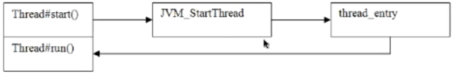
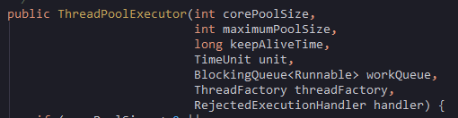
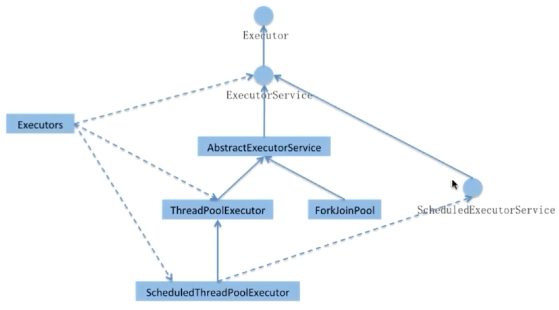
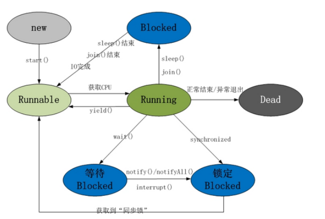

### 1.线程和进程的区别

### 2.java进程和线程的关系

a.运行一个程序会产生一个进程，进程至少包含一个线程

b.每个进程对应一个jvm实例，多个线程共享jvm里的堆

c. java采用单线程编程模型，程序会自动创建主线程

### 3.Thread中start和run的区别

a.查看openJDK源码，发现start是调用JVM_StartThread创建新的子线程；

b.而run()只是Thread的一个普通方法调用

```java
public static void eat(){
    System.out.println("猫吃鱼");
    System.out.println("执行当前方法线程："+Thread.currentThread().getName());
};
public static void main(String[] args) {
    Thread t1 = new Thread(){
        public void run(){
            eat();
        }
    };
    // t1.run(); // main线程
    t1.start(); //Threan-0线程
}
```

### 4.如何实现处理线程的返回值

```java
public class CycleWate implements Runnable{
    private String name;
    @Override
    public void run() {
        try {
            Thread.currentThread().sleep(5000);
        } catch (InterruptedException e) {
            e.printStackTrace();
        }
        name = "zql";
    }
    //主线程
    public static void main(String[] args) throws InterruptedException {
        CycleWate cw = new CycleWate();
        Thread thread1= new Thread(cw);
        thread1.start();
        //主线程循环等待直到子线程返回值才继续执行
//        while (null==cw.name){
//            Thread.currentThread().sleep(1000);
//        }
        thread1.join();
        System.out.println(cw.name);
    }
}
```

1. **主线程等待法：**缺点非常明显，需要自己写等待逻辑，参数过多的话代码会非常雍肿

2. **使用Thread类的****join方法:** 阻塞当前线程以等待子线程处理完毕,缺点是粒度不够细

3. **通过callable接口实现**：

   通过FutureTask 或者线程池获取，通过isDone()判断是否完成，get()获取返回值

```java
public class FutureTasktest {
    public static void main(String[] args) throws ExecutionException, InterruptedException {
            FutureTask<String> task = new FutureTask<String>(new MyCallabel());
            Thread thread1 = new Thread(task);
            thread1.start();
        if (!task.isDone()){
            System.out.println("task is waiting");
        }
        System.out.println("task return : "+task.get());
    }
}
```

线程池

```java
public class ThreadPoolDemo {
    public static void main(String[] args) {
        ExecutorService newCachedThreadPool = Executors.newCachedThreadPool();
        Future<String> submit = newCachedThreadPool.submit(new MyCallabel());
        if (submit.isDone()){
            System.out.println("task is waiting");
        }
        try {
            System.out.println("task return : "+submit.get());
        } catch (InterruptedException e) {
            e.printStackTrace();
        } catch (ExecutionException e) {
            e.printStackTrace();
        }finally {
            //关闭线程池
            newCachedThreadPool.shutdown();

    }
    }
}
```

### 5.线程的状态

1. new(新建)：线程新建的状态,创建后尚未启动的线程的状态
2. runnable（运行）：包含running和ready，该状态是一个复合状态，包含ready和Running两种**，前者表示准备好被调度器调用。后者表示正在运行状态。执行Thread.yield()其状态可能会由Running变为ready状态，**ready状态的线程又被称为活跃线程
3. waiting（无限期等待）：等待状态，如调用wait()或join()方法不会被分配cpu执行之间，需要被显示唤醒。
4. timed waiting（限期等待）：等待状态，跟waiting不同的是，不是无限制的等待，而是有时间的等待。等待超时就处于Runnable状态，如wait(long time)，sleep(time)等
5. blocked（阻塞）：等待获取排它锁
6. temindated（结束）：已终止线程的状态，线程已经结束执行

### 6 sleep()和wait()的区别？

#### **6.1 基本的差别：**

sleep是Thread的方法。wait是Object的方法

sleep方法可以在任何地方使用，wait方法只能在synchrinozed方法或者synchriozed方法块中使用

#### **6.2 本质区别**

sleep只释放cpu资源，wait释放资源也释放同步锁（synchrinozed）

#### **6.3测试**

​	通过对obj对象加上同步锁，改变线程A的sleep()和wait()方法，测试出来：

​	如果是sleep()，那么，线程B肯定在A执行完毕后才能获得锁；如果是wait()，线程B可以在A执行完毕前获得锁

```java
public class SleepWaitDemo{
    public static void main(String[] args) throws InterruptedException {
        final Object obj = new Object();
        new Thread(new Runnable() {
            @Override
            public void run() {
                System.out.println("线程A等待获得锁");
                synchronized (obj){
                    System.out.println("线程A得到了锁");
                    try {
                        //不传参数则无期限等待，并且释放锁
                         obj.wait(100);
                      //  Thread.sleep(100);
                        System.out.println("线程A执行结束");
                    } catch (InterruptedException e) {
                        e.printStackTrace();
                    }
                }
            }
        }).start();
        //主线程等待上面的线程100ms在执行
        try {
            Thread.sleep(10);
        }catch (Exception e){
            e.printStackTrace();
        }
        new Thread(new Runnable() {
            @Override
            public void run() {
                System.out.println("线程B等待获得锁");
                //如果上面的线程不释放锁，那么这里的B无法获得obj的同步锁
                synchronized (obj){
                    System.out.println("线程B得到了锁");
                    try {
                        Thread.sleep(2000);
                        System.out.println("线程B执行结束");
                    } catch (InterruptedException e) {
                        e.printStackTrace();
                    }
                }
            }
        }).start();
    }
}
```

### 7.notify()和notifyAll()区别？

#### **7.1 锁池EntryList**

#### **7.2 等待池WaitSet**

notifyAll() 方法会让所用处于等待池WaitSet的线程全部进入锁池去EntryList竞争获取锁的机会，此时优先级高的线程获取锁的机会越大

notify() 方法会随机选取一个等待池的线程进入锁池去竞争获取锁的机会

#### **7.3 测试**

通过打印线程被唤醒的条数来验证结论

### 8.yield()

JDK对该方法的描述：

**A hint to the scheduler that the current thread is willing to yield*

** its current use of a processor. The scheduler is free to ignore this*

** hint.*

即：暗示调度器当前线程的CPU使用权，调度器可能会忽略这个暗示

yield()不会释放锁（利用上面的代码再线程B中调用Thread.yield()）

### 9.interrupt()

### 10.线程池

#### **10.1.线程池的7个参数**

即ThreadPoolExecutor的构造函数参数



参考文章：https://blog.csdn.net/ye17186/article/details/89467919

#### **10.2.利用Executors创建不同的线程池**

##### **10.2.1 newCachedThreadPool**

1. 线程池中数量没有固定，可达到最大值（Interger. MAX_VALUE） 
2. 线程池中的线程可进行缓存重复利用和回收（回收默认时间为1分钟） 
3. 当线程池中，没有可用线程，会重新创建一个线程

```java
return new ThreadPoolExecutor('corePoolSize'0, Integer.MAX_VALUE,
                              'keepAliveTime'60L, TimeUnit.SECONDS,
                              new SynchronousQueue<Runnable>(),
                              threadFactory);
```

##### **10.2.2 newFixedTreadPool**

创建一个可重用固定线程数的线程池，以共享的无界队列方式来运行这些线程。在任意点，在大多数 nThreads 线程会处于处理任务的活动状态。如果在所有线程处于活动状态时提交附加任务，则在有可用线程之前，附加任务将在队列中等待。如果在关闭前的执行期间由于失败而导致任何线程终止，那么一个新线程将代替它执行后续的任务（如果需要）。在某个线程被显式地关闭之前，池中的线程将一直存在。

特征： 

1. 线程池中的线程处于一定的量，可以很好的控制线程的并发量 
2. 线程可以重复被使用，在显示关闭之前，都将一直存在 
3. 超出一定量的线程被提交时候需在队列中等待

```java
public static ExecutorService newFixedThreadPool(int nThreads) {
    return new ThreadPoolExecutor(nThreads, nThreads,
                                  0L, TimeUnit.MILLISECONDS,
                                  new LinkedBlockingQueue<Runnable>());
}
```

##### **10.2.3 newSingleTreadPool**

创建一个使用单个 worker 线程的 Executor，以无界队列方式来运行该线程。（注意，如果因为在关闭前的执行期间出现失败而终止了此单个线程，那么如果需要，一个新线程将代替它执行后续的任务）。可保证顺序地执行各个任务，并且在任意给定的时间不会有多个线程是活动的。与其他等效的 newFixedThreadPool(1) 不同，可保证无需重新配置此方法所返回的执行程序即可使用其他的线程。

特征： 

1. 线程池中最多执行1个线程，之后提交的线程活动将会排在队列中以此执行

```java
public static ExecutorService newSingleThreadExecutor() {
    return new FinalizableDelegatedExecutorService
        (new ThreadPoolExecutor(1, 1,
                                0L, TimeUnit.MILLISECONDS,
                                new LinkedBlockingQueue<Runnable>()));
}
```

##### **10.2.4 newScheduleThreadPool**

 创建一个线程池，它可安排在给定延迟后运行命令或者定期地执行。

特征： 

1. 线程池中具有指定数量的线程，即便是空线程也将保留 
2. 可定时或者延迟执行线程活动

```java
public static ScheduledExecutorService newScheduledThreadPool(int corePoolSize) {
    return new ScheduledThreadPoolExecutor(corePoolSize);
}
```


##### **10.2.5 newSingleScheduleThreadPool**

 创建一个单线程执行程序，它可安排在给定延迟后运行命令或者定期地执行。

特征： 

（1）线程池中最多执行1个线程，之后提交的线程活动将会排在队列中以此执行 

（2）可定时或者延迟执行线程活动

```java
public static ScheduledExecutorService newSingleThreadScheduledExecutor() {
    return new DelegatedScheduledExecutorService
        (new ScheduledThreadPoolExecutor(1));
}
```

##### 10.2.6 newWorkStealingPool  ,**最后一个jdk8才有

```java
public static ExecutorService newWorkStealingPool() {
    return new ForkJoinPool
        (Runtime.getRuntime().availableProcessors(),
         ForkJoinPool.defaultForkJoinWorkerThreadFactory,
         null, true);
}
```

#### 10.2 线程池的适用场景

1. newCachedThreadPool：用来创建一个可以无限扩大的线程池，适用于服务器负载较轻，执行很多短期异步任务。

2. newFixedThreadPool：创建一个固定大小的线程池，因为采用无界的阻塞队列，所以实际线程数量永远不会变化，适用于可以预测线程数量的业务中，或者服务器负载较重，对当前线程数量进行限制。

3. newSingleThreadExecutor：创建一个单线程的线程池，适用于需要保证顺序执行各个任务，并且在任意时间点，不会有多个线程是活动的场景。

4. newScheduledThreadPool：可以延时启动，定时启动的线程池，适用于需要多个后台线程执行周期任务的场景。

5. newWorkStealingPool：创建一个拥有多个任务队列的线程池，可以减少连接数，创建当前可用cpu数量的线程来并行执行，适用于大耗时的操作，可以并行来执行

   

#### 10.3 线程池状态

#### 10.4 线程池的大小如何选定

### 11 **Executor框架**



### 12 ThreadLocal原理，使用场景？

参考地址：https://www.cnblogs.com/fengzheng/p/8690253.html

#### 13.1 **ThreadLocal**介绍

**首先ThreadLocal和本地线程没有一毛钱关系，更不是一个特殊的Thread，它只是一个线程的局部变量(其实就是一个Map),，并不是解决资源共享的问题，而是用来提供线程内的局部变量，这样每个线程都自己管理自己的局部变量，别的线程操作的数据不会对我产生影响，互不影响，所以不存在解决资源共享这么一说，如果是解决资源共享，那么其它线程操作的结果必然我需要获取到，而ThreadLocal则是自己管理自己的，相当于封装在Thread内部了，供线程自己管理。**即ThreadLocal会为每个使用该变量的线程提供独立的变量副本，所以每一个线程都可以独立地改变自己的副本，而不会影响其它线程所对应的副本。这样做其实就是以空间换时间的方式(与synchronized相反)，以耗费内存为代价，大大减少了线程同步(如synchronized)所带来性能消耗以及减少了线程并发控制的复杂度。但需要注意的是，虽然ThreadLocal和Synchonized都用于解决多线程并发访问，ThreadLocal与synchronized还是有本质的区别。synchronized是利用锁的机制，使变量或代码块在某一时该只能被一个线程访问。而ThreadLocal为每一个线程都提供了变量的副本，使得每个线程在某一时间访问到的并不是同一个对象，这样就隔离了多个线程对数据的数据共享。而Synchronized却正好相反，它用于在多个线程间通信时能够获得数据共享。即Synchronized用于线程间的数据共享，而ThreadLocal则用于线程间的数据隔离。所以ThreadLocal并不能代替synchronized，Synchronized的功能范围更广(同步机制)。

[[使用场景说到底就概括成一个：就是当我们只想在本身的线程内使用的变量，可以用 ThreadLocal 来实现，并且这些变量是和线程的生命周期密切相关的，线程结束，变量也就销毁了。所以说 ThreadLocal 不是为了解决线程间的共享变量问题的，如果是多线程都需要访问的数据，那需要用全局变量加同步机制]()

#### 13.2 **ThreadLocal实现原理？**

1. 每个线程都有一个 ThreadLocalMap 类型的 threadLocals 属性。
2. ThreadLocalMap 类相当于一个Map，key 是 ThreadLocal 本身，value 就是我们的值。
3. 当我们通过 threadLocal.set(new Integer(123)); ，我们就会在这个线程中的 threadLocals 属性中放入一个键值对，key 是 这个 threadLocal.set(new Integer(123)) 的 threadlocal，value 就是值。
4. 当我们通过 threadlocal.get() 方法的时候，首先会根据这个线程得到这个线程的 threadLocals 属性，然后由于这个属性放的是键值对，我们就可以根据键 threadlocal 拿到值。 注意，这时候这个键 threadlocal 和 我们 set 方法的时候的那个键 threadlocal 是一样的，所以我们能够拿到相同的值。

#### 13.3 **如果A线程和B线程怎么分享ThreadLocal中的变量？**

父线程的ThreadLocal变量要传递到子线程中去的话，使用InheritableThreadLocal实现

#### 13.4 **为什么ThreadLocal每次用完都需要remove？**

因为比如说建了线程池，那么线程是复用的，所以如果不remove的话，线程ThreadLocal的局部变量就又会被使用，导致业务错误

#### 13.5 Inheritable ThreadLocal实现原理，是如何弥补ThreadLocal不支持继承的，应用场景？

InheritableThreadLocal 是继承于ThreadLocal的

https://blog.csdn.net/ni357103403/article/details/51970748

### 13 synchronized 原理

synchronized内部通过对象监视器实现，因为每个对象都有一个监视器锁（Monitor），当monitor被占用时就会处于锁定状态，线程执行monitorenter指令时尝试获取monitor的所有权，过程如下：

1.如果monitor的进入数为0，则该线程进入monitor，然后将进入数设置为1，该线程即为monitor的所有者

2.如果线程已经占有该monitor，只是重新进入，则进入monitor的进入数加1

3.如果其他线程已经占用了monitor，则该线程进入阻塞状态，直到monitor的进入数为0，再重新尝试获取monitor的所有权

4.Synchronized的语义底层是通过一个monitor的对象来完成，其实wait/notify等方法也依赖于monitor对象，这就是为什么只有在同步的块或者方法中才能调用wait/notify等方法，否则会抛出java.lang.IllegalMonitorStateException的异常的原因。

### 14  CAS，Collections原理

#### 14.1 CAS是什么，有什么缺陷，怎么解决

CAS，比较并交换，V（内存值），E（预期值），N（新值），当V==E时才更新，如果不相等，表示其他线程修改过，则放弃修改，返回V

会出现ABA问题，一个线程将V修改为从A修改为B，再从B修改到A，其他线程会感觉没有线程修改的错觉

解决：AtomicStampedReference：使用时间戳（作为版本号）但是比较鸡肋，改用传统的互斥同步可能比原子类更高效

AtomicMarkableReference：

### 15 Runnable和Callable的区别

#### 15.1相同的

#### 15.2 不同点

​	callable接口可以通过FutureTask 的isDone()和get()方法获取线程的返回值；runnable不可以

​	callable需要实现call()方法，该方法允许抛出异常；而runnable需要实现run()方法，该方法不能向上抛出异常，只能再内部处理

### 16 volatile关键字的用法

### 17.多线程中的cyclicBarrier，CountDownLatch，semaphore（信号灯），join原理和区别

#### **17.1 CyclicBarrier**：

同步屏障，可以控制多个线程都执行完成后或到达某个状态后，再同时执行，countDown()计数器减1，await()计数器为0时线程执行，如：公司聚餐，人都到齐了，再开始吃饭

#### **17.2 CountDownLatch**：

线程计数器，可以控制线程执行顺序，一个或多个线程执行完成后，再执行某些线程，await()达到状态等待全部执行完成，如：坐火车，乘客都上车后，火车才开始发车

#### **17.3 Semaphore**：

信号量，控制同时访问的线程数（如两个线程循环对一个数加1），acquire()获取一个许可，release()释放一个许可，如：公司有10个人，只有2台打印机，每次只能两个人使用，其他人只有等待他人没有占用打印机后才能使用

#### **17.4 Join：**

一个线程执行完后，才执行另外一个，内部是通过wait实现，而Synchronized内部是通过对象监视器实现，并且如果在join过程中，当前对象被终端，则抛出异常

### 18 多线程之间怎么通信

主要的方式就是**共享内存**的方式：主要关注可见性，有序性，原子性

当然还有

同步

wait/notify

管道通信就是使用java.io.PipedInputStream 和 java.io.PipedOutputStream进行通信

### 19 线程的几种状态和生命周期

1.**New**：线程新建，如Thread t = new Thread();

2.**Runnable**：线程就绪状态，如thread.start()，此时线程还没有执行，只是已经做好准备，随时等待CPU调度执行

3.**Running**：线程运行，CPU正在调度线程

4.**Blocked**：线程阻塞，暂时放弃了CPU使用权，停止执行，进入阻塞状态，直到其进入就绪状态，才有机会被CPU调度

5.**Dead**，线程死亡，线程执行完成或者因异常退出run方法，结束生命周期




### 20 一个线程连着调用start两次会发生什么

会报java.lang.IllegalThreadStateException错误，因为线程start方法，会判断线程状态是否等于0，不等于则会抛出线程状态异常问题

```java
public synchronized void start() {
        if (this.threadStatus != 0) {
            throw new IllegalThreadStateException();
        } 
......
```

### 21 现在有T1，T2，T3三个线程，你怎样保证T2在T1执行完成后执行，T3在T2执行完成后执行

#### 1.join（）

​	thread类中的join方法的主要作用就是同步，它可以使得线程之间的并行执行变为串行执行。当我们调用某个线程的这个方法时，这个方法会挂起调用线程，直到被调用线程结束执行，调用线程才会继续执行。

​	thread1.start();

​	thread1.join();

​	thread2.start();

​	thread2.join();

​	thread3.start();

#### 2.CountDownLatch（两个CountDownLatch对象A,B）

#### 3.Semaphore(两个信号量A,B)

#### 4.Condition（两个condition）

### 22.Java中你怎样唤醒一个阻塞的线程

#### 1.suspend与resume

Java废弃 suspend() 去挂起线程的原因，是因为 suspend() 在导致线程暂停的同时，并不会去释放任何锁资源。其他线程都无法访问被它占用的锁。直到对应的线程执行 resume() 方法后，被挂起的线程才能继续，从而其它被阻塞在这个锁的线程才可以继续执行。 

但是，如果 resume() 操作出现在 suspend() 之前执行，那么线程将一直处于挂起状态，同时一直占用锁，这就产生了死锁。而且，对于被挂起的线程，它的线程状态居然还是 Runnable。

#### 2.wait与notify

wait与notify必须配合synchronized使用，因为调用之前必须持有锁，wait会立即释放锁（不是notify后释放），notify则是同步块执行完了才释放

#### 3.await与singal

Condition类提供，而Condition对象由new ReentLock().newCondition()获得，与wait和notify相同，因为使用Lock锁后无法使用wait方法

#### 4.park与unpark

​	LockSupport是一个非常方便实用的线程阻塞工具，它可以在线程任意位置让线程阻塞。和Thread.suspenf()相比，它弥补了由于resume()在前发生，导致线程无法继续执行的情况。和Object.wait()相比，它不需要先获得某个对象的锁，也不会抛出IException异常。可以唤醒指定线程。

```java
public static void main(String[] args)
{
     Thread thread = Thread.currentThread();
     LockSupport.unpark(thread);//释放许可
     LockSupport.park();// 获取许可
     System.out.println("b");
}
```

LockSupport是不可重入的，如果一个线程连续2次调用LockSupport.park()，那么该线程会一直阻塞下去

https://blog.csdn.net/fxkcsdn/article/details/82082560

**23.什么是伪共享（false sharing），为什么会出现，如何避免

#### 1 什么是伪共享

CPU缓存中是以缓存行（cache line）为存储单位的，缓存行是2的整数幂个连续字节，一般为32-256个字节。最常见的缓存行大小是64个字节，如果多线程修改互相独立的变量时，刚好这些变量共用一个缓存行，就会无意中影响彼此的性能，这就是伪共享

#### **2 解决方法：**

我们知道一条缓存行有64字节, 而Java程序的对象头固定占8字节(32位系统)或12字节(64位系统默认开启压缩, 不开压缩为16字节). 我们只需要填6个无用的长整型补上6*8=48字节, 让不同的VolatileLong对象处于不同的缓存行, 就可以避免伪共享了(64位系统超过缓存行的64字节也无所谓,只要保证不同线程不要操作同一缓存行就可以)。这个办法叫做补齐(Padding)。

#### **3 Java8中的解决方案**

Java8中已经提供了官方的解决方案，Java8中新增了一个注解：@sun.misc.Contended。加上这个注解的类会自动补齐缓存行，需要注意的是此注解默认是无效的，需要在jvm启动时设置-XX:-RestrictContended才会生效。

https://www.cnblogs.com/myf008/p/8503232.html

### 23.为什么线程的状态切换影响性能？

因为Java的线程是映射到操作系统的原生线程上的，如果要阻塞和唤醒一个线程都需要操作系统来帮忙，这就需要从用户态切换到内核态中，因此状态切换需要耗费更多的处理器时间

所以互斥同步对性能影响最大的就是阻塞/唤醒，可以使用自旋锁防止频繁切换到内核态中

### 24.线程调度，JVM使用的线程调度

抢占式调度（Java使用的线程调度）

协同式调度

### 25.Java中yield和join的区别

yield意味着放手，放弃，投降。一个调用yield()方法的线程告诉虚拟机它乐意让其他线程占用自己的位置。这表明该线程没有在做一些紧急的事情。注意，这仅是一个暗示，并不能保证不会产生任何影响。

线程实例的方法join()方法可以使得一个线程在另一个线程结束后再执行。如果join()方法在一个线程实例上调用，当前运行着的线程将阻塞直到这个线程实例完成了执行。

### 26.wait(long)和sleep(long)的区别

wait(long)必须配合同步块和同步方法才能使用

### 27.多线程中生产者-消费者模式的实现

​	1.可以通过wait/notify(一个生产者一个消费者)，wait/notifyAll实现(多个生产者多个消费者)，也可以通过Semaphore实现（notify唤醒的是随机的线程）

​	2.ReentrantLock+Condition实现等待通知（可以唤醒指定线程）

### 28.两个线程循环对一个数加1

1.Semaphore（定义两个信号量，获取许可+1操作后，释放对方的许可）

2.wait/notify（配合synchronized实现阻塞唤醒）

3.ReentrantLock+condition（通过await()和signal()实现）

### 29.说一下线程优先级，如果优先级设置不恰当会引起什么后果？（线程饥饿）

#### **1 概念**

如果一个线程因为 CPU 时间全部被其他高优先级线程抢走而得不到 CPU 运行时间，这种状态被称之为“饥饿”；

#### 2 饥饿原因

1. 高优先级线程吞噬所有的低优先级线程的 CPU 时间。
2. 线程被永久堵塞在一个等待进入同步块的状态，因为其他线程总是能在它之前持续地对该同步块进行访问。
3. 线程在等待一个本身(在其上调用 wait())也处于永久等待完成的对象，因为其他线程总是被持续地获得唤醒。

### 30.Java线程中的yield，join和sleep的区别（概念上）

1.**yield**：表示告诉线程调度器，我现在不急，如果有其他线程需要处理器资源的话就给他，如果没有，也不介意继续占用。

可以让出cpu资源，但是不一定让出，不会释放锁

2.**join**：表示告诉当前线程和线程调度器，我先暂停一会儿，等其他线程执行完了再执行

等待其它线程的返回结果

3.**sleep**：表示告诉线程调度器，我先睡一会儿，时间到了叫醒我

让出cpu资源，不会释放锁

### 31.什么是线程竞态

多线程编程中，经常遇到一个问题，对于同样的输入，程序有时候输出有时候是正确的有时候是错误的，这种一个计算结果的正确性与时间有关的现象就称为竞态


