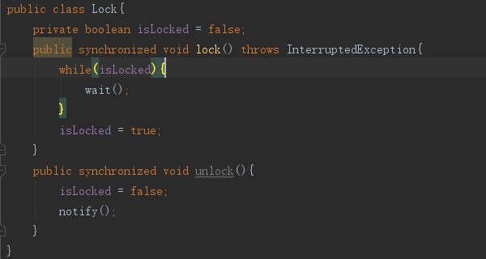
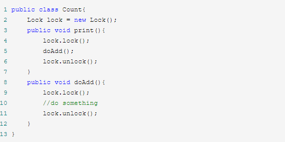

### 2.互斥锁

#### **2.1 互斥性**

​	即在同一时间只允许一个线程持有某个对象锁，通过这种特性来实现多线程的协调机制，这样在同一时间只有一个线程对需要同步的代码块进行访问。互斥性也称为操作的原子性

#### **2.2 可见性**

必须确保在锁被释放之前，对共享变量做出的修改，对于随后获得该锁的另一个线程时可见的，即在获得锁时应获得最新共享变量的值，否则另一个线程可能是在本地缓存的某个副本上继续操作，从而引起不一致

#### **2.3 获取对象锁**


#### 2.4 对象锁和类锁总结

​	1.有线程访问对象的同步代码块时，另外的线程可以访问该对象的非同步代码块

​	2.若锁住的是同一个对象，一个线程在访问对象的同步代码块时，另一个访问对象的同步代码块的线程会被阻塞

​	3.若锁住的时同一个对象，一个线程在访问对象的同步方法时，另一个访问对象同步方法线程会被阻塞

​	4.若锁住的是同一个对象，一个线程在访问对象的同步代码块时，另一个访问对象同步方法的线程会被阻塞，反之亦然

​	5.同一个类的不同对象的对象锁互不干扰

​	6.类锁由于也是一种特殊的锁，表现和上述1234一致

​	7.类锁和对象锁互不干扰

### 3.synchronized锁的实现原理

参考文章 http://www.cnblogs.com/xdyixia/p/9364247.html

#### **3.1 对象头结构**

##### 3.1.1**Mark word**


##### 3.1.2 **Monitor**

​	可以理解为一个同步工具，也可以理解为一种同步机制，通常描述为一把锁。每个java对象都自带monitor锁。

​	Monitor 是线程私有的数据结构，每一个线程都有一个可用monitor record列表，同时还有一个全局的可用列表。每一个被锁住的对象都会和一个monitor关联（对象头的MarkWord中的LockWord指向monitor的起始地址），同时monitor中有一个Owner字段存放拥有该锁的线程的唯一标识，表示该锁被这个线程占用。

结构如下:


Owner：初始时为NULL表示当前没有任何线程拥有该monitor record，当线程成功拥有该锁后保存线程唯一标识，当锁被释放时又设置为NULL。

EntryQ：关联一个系统互斥锁（semaphore），阻塞所有试图锁住monitor record失败的线程。

RcThis：表示blocked或waiting在该monitor record上的所有线程的个数。

Nest：用来实现重入锁的计数。HashCode:保存从对象头拷贝过来的HashCode值（可能还包含GC age）。

Candidate：用来避免不必要的阻塞或等待线程唤醒，因为每一次只有一个线程能够成功拥有锁，如果每次前一个释放锁的线程唤醒所有正在阻塞或等待的线程，会引起不必要的上下文切换（从阻塞到就绪然后因为竞争锁失败又被阻塞）从而导致性能严重下降。Candidate只有两种可能的值0表示没有需要唤醒的线程1表示要唤醒一个继任线程来竞争锁　　

**Monitor锁的竞争，获取与释放，monitor对象存在于每个java对象的对象头中**


##### **3.1.3 重入**

从互斥锁的设计来说：当一个线程试图操作一个由其它线程持有的对象锁临界资源时，将会处于阻塞状态，但当一个线程再次请求自己持有的锁的临界资源时，这种情况属于重入。

**查看同步代码块和同步方法的字节码**

##### **3.1.4 synchronized效率的提升**

**在1.6之前**

synchronizd属于重量级锁，依赖于Mutex Lock(互斥锁)实现

线程之间的切换需要从用户态切换到核心态（java操作线程需要操作系统来帮忙，即从用户态切换到核心态），开销较大

1.6后，优化了很多锁 ,自旋锁和自适应锁

###### 3.1.4.1 **自旋锁**

​	许多情况下，共享数据的锁定状态持续时间较短，切换线程不值得；通过让线程执行忙循环等待锁的释放，不会让出CPU

​	缺点：若锁被其它线程长时间占用，会带来许多性能开销。如果自旋次数超过了限定的尝试次数，还没有成功获取到锁，就应该使用传统的方式挂起线程。使用PreBlockSpin来更改

######   **3.1.4.2 自适应自旋锁**

​	自旋的次数不固定，由前一次在同一个锁上的自旋时间及锁的拥有者的状态来决定。jvm对自旋的次数预测更加准确。

###### **3.1.4.3锁消除**

​	JIT编译时，对上下文进行扫描，去除不可能存在竞争的锁。减少毫无意义的锁时间。

###### **3.1.4.4 锁粗化**

​	比如锁操作发生在循环中。就把锁加到循环外

#### 3.2 synchronized代码块的实现原理

#### 3.3 synchronized方法的实现原理

#### 3.4 synchronized的四种状态

##### 3.4.1 锁膨胀的方向

无锁->偏向锁->轻量级锁->重量级锁

###### 3.4.1.1  **偏向锁**

减少同一线程获取锁的代价

很多时候访问一个代码块都是同一个线程

当一个线程访问同步块并获取锁时，对象头和栈帧中的锁记录里，存储锁偏向的线程id，以后该线程再进行锁进入和退出不需要进行cas操作来加锁和解锁，提高了程序性能。即：如果一个线程获得了锁，那么锁就进入偏向模式。此时mark word结构也变为偏向锁结构，当线程再次请求锁的时候，无需在做任何同步操作，即获取锁只需要检查Mark word的锁标记位为偏向锁以及当前线程id等于mark word的threadId即可，这样就省去了大量有关锁申请的操作。

不适用于锁竞争比较激烈的多线程场合

###### 3.4.1.2 轻量级锁（偏向锁的并发?）

​	由偏向锁膨胀而来：偏向锁运行在一个线程进入同步块的情况下，当第二个线程加入锁竞争的时候，偏向锁就升级为轻量级锁

适用于线程交替执行同步块

若存在同一时间访问同一锁的情况，则膨胀为重量级锁

轻量级锁加锁和解锁的过程 https://www.cnblogs.com/paddix/p/5405678.html

### 4.偏向锁，轻量级锁，重量级锁的对比


### 5 .Synchronized和ReentrantLock（再入锁）的区别？

### 6.volatile和synchronized的区别？


### 7.乐观锁 cas（campare and swap）

cas包含3个操作数--内存位置V，预期值A，新值B。更新前先对比是否V==A，如果相等则更新为B

**缺点**

若循环时间过长，则开销很大

只能保证一个共享变量的原子操作

的问题

----面试题

### 8.基于AQS实现的锁，信号量，计数器原理

AQS：AbstractQueuedSynchronized 抽象队列同步器

常用的如ReentrantLock/CountDownLatch/Semaphore都依赖于AQS（CyclicBarrier是直接依赖于ReentrantLock）

### 9.static加锁（静态同步方法和同步块区别）

前者是类锁，后者是对象锁

### 10.读写锁

### 11..什么是锁消除（同步消除）和锁粗化

#### **11.1 锁消除**

​	锁消除是发生在编译器级别的一种锁优化方式。有时候我们写的代码完全不需要加锁，却执行了加锁操作。

#### **11.2锁粗化**

​	通常情况下，为了保证多线程间的有效并发，会要求每个线程持有锁的时间尽可能短，但是在某些情况下，一个程序对同一个锁不间断、高频地请求、同步与释放，会消耗掉一定的系统资源，因为锁的请求、同步与释放本身会带来性能损耗，这样高频的锁请求就反而不利于系统性能的优化了，虽然单次同步操作的时间可能很短。锁粗化就是告诉我们任何事情都有个度，有些情况下我们反而希望把很多次锁的请求合并成一个请求，以降低短时间内大量锁请求、同步、释放带来的性能损耗。

```java
for(int i=0;i<size;i++){
    synchronized(lock){
    }
}
//需要粗化
synchronized(lock){
    for(int i=0;i<size;i++){
    }
}
```

### 12.公平锁和非公平锁底层是怎么实现的

公平和非公平锁的队列都基于锁内部维护的一个双向链表，表结点Node的值就是每一个请求当前锁的线程。

公平锁：则在于每次都是依次从队首取值

非公平锁：在等待锁的过程中， 如果有任意新的线程妄图获取锁，都是有很大的几率直接获取到锁的

### 13.可重入锁中对应的wait和notify

必须要和sysnchonized配合使用（同步块或者同步方法）

wait():线程释放对象锁，进入等待队列

notify():随机唤醒一个线程

### 14.自旋锁和自适应自旋

#### **自旋锁：**

​	当线程竞争锁时，会在原地循环等待，不放弃处理器执行时间（当然需要有一个以上的处理器），而不是阻塞（避免切入内核态消耗性能），直到获得锁

​	本来一个线程把锁释放之后，当前线程是能够获得锁的，但是假如这个时候有好几个线程都在竞争这个锁的话，那么有可能当前线程会获取不到锁，还得原地等待继续空循环消耗cup，甚至有可能一直获取不到锁。

​	==基于这个问题，我们必须给线程空循环设置一个次数，当线程超过了这个次数，我们就认为，继续使用自旋锁就不适合了，此时锁会再次膨胀，升级为重量级锁==

#### **自适应自旋：**

线程空循环等待的自旋次数并非是固定的，而是会动态着根据实际情况来改变自旋等待的次数

### 15.轻量级锁和重量级锁（互斥量）

注，轻量级锁并不是拿来代替重量级锁的

### 16.Java中的悲观锁和乐观锁

悲观锁，如synchronized

乐观锁，基于CAS操作，如RetreenLock，轻量级锁，偏向锁，自旋锁

https://blog.csdn.net/kirito_j/article/details/79201213

### 17.ReentrantLock实现原理

是基于内部类FairSync（公平锁）和NonFairSync（非公平锁）实现的。

可重入性是基于Thread.currentThread()实现的：如果当前线程已经获得了执行序列中的锁，那执行序列之后的所有方法都可以获得这个锁

### 18.ReentrantReadWriteLock读写锁

1.ReentrantLock是一个排他锁，同一时间只允许一个线程访问，而读写锁允许多个读线程同时访问，但不允许写线程和读线程，写线程和写线程同时访问，提高了并发性

2.内部维护了两个锁，一个用于读操作lock.readLock()，一个用户写操作lock.writeLock()

3.支持公平和非公平的获取锁方式

4.支持可重入

5.允许锁降级，实现方式：写获取写锁，再获取读锁，最后释放写锁，但不支持锁升级

6.读锁和写锁都支持锁获取期间的中断

7.写锁支持condition

### 19.写一个死锁

### 20.Java中的显示锁和内部锁

**内部锁：**是通过syncronized实现的（内部锁属于非公平锁，优势是不会锁泄漏）

**显示锁：**通过Java.concurrent.locks.Lock接口的实现类java.concurrent.locks.ReentrantLock实现的（既有公平锁又有非公平锁）

### 21.Java中的可重入锁和不可重入

#### **21.1可重入：**

synchronized

java.util.concurrent.locks.ReentrantLock

### **21.2不可重入：**





22.不正确使用锁会导致什么情况

**1.死锁：**

两个线程互相等待对方释放自己需要的锁，造成一直等待都无法获得锁

**2.锁泄露**：

​	一个线程占着锁一直无法释放，导致其他线程无法获得锁，危害在于不易被发现，比如一个可重入锁在锁争程度不高的时候，一直获取锁也不妨碍其他线程运行。但是随着争用程度变高，就可能导致其他线程一直无法获得锁，但可能此时已经在线上运行了

**3.锁死**