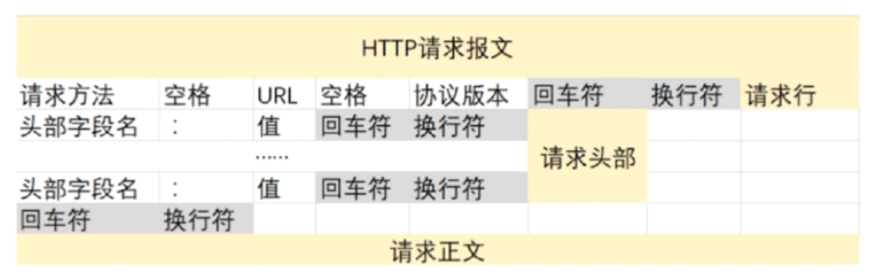
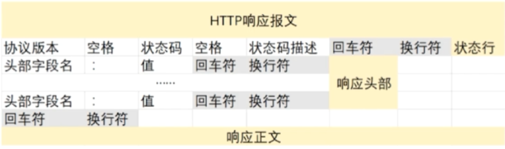
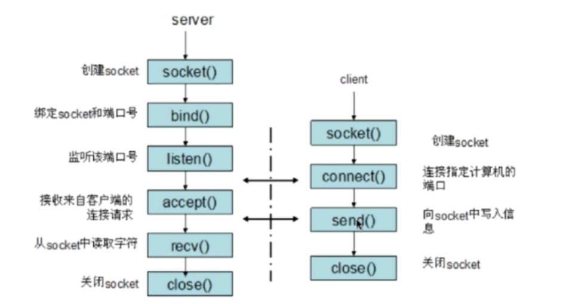

###1.http

#### 1.1 http的主要特点

- 支持客户端/浏览器模式
- 简单快速
- 灵活
- 无连接
- 无状态

#### 1.2.HTTP的请求头结构

#### 1.3.响应头结构

#### 1.4.HTTP的请求/响应步骤

1. 客户端连接到web服务器
2. 发送http请求
3. 服务器接收请求并返回http响应
4. 释放连接tcp连接
5. 客户端浏览器解析html内容

### 2.在浏览器地址栏键入URL，按下回车之后经历的流程

1. DNS解析
2. TCP连接
3. 发送http请求
4. 服务器处理请求并返回http报文
5. 浏览器解析渲染页面
6. 连接结束

### 3.HTTP状态码

a.5种类型可能的取值

​	1xx，2xx，3xx，4xx，5xx

b.常见的状态码

- 200 OK	
- 400 bad request
- 401 unauthorized
- 403	forbidden
- 404	not found
- 500	internal server error 服务器遇到错误，无法完成请求
- 503 server unavailable 服务不可用

### 4.面试题:get和post请求的区别

1. http报文层面：get将请求信息放在url，post请求放在报文体中
2. 数据库层面：get符合幂等性和安全性，post不行
3. 其他层面：get可以被缓存，被存储，post不行

### 5.cookie和session的区别

#### 5.1 cookie

1. 是由服务器发给客户端的特殊信息，以文本的形式存放在客户端
2. 客户端再次请求的时候，会把cookie回发
3. 服务器接收到后，会解析cookie生成与客户端相对应的内容 

##### 5.1.1cookie的设置及发送过程

#### 5.2 session

1. 服务器端的机制，在服务器上保存的信息
2. 解析客户端请求并操作session id，按需保存状态信息
3. session的实现方式
4. 使用cookie来实现
5. 使用url回显来实现

#### 5.3 区别

1. cookie数据存放在客户端的浏览器上，session数据放在服务器上
2. session相对于cookie更加安全
3. 如果考虑减轻服务器的负担，则使用cookie

### 6.ssl---security sockets layer 安全套接层 

11.加密方式

1. 对称加密:加密和解密都使用同一个密钥
2. 非对称加密：加密使用的密钥和解密使用的密钥是不同的
3. 哈希算法:将任意长度的信息转换为固定长度的值，算法不可逆
4. 数字签名：证明某个消息或者文件是某人发出，认可的

### 12.https传输数据的流程 

1. 浏览器将支持的加密算法信息发送给服务器
2. 服务器选择一套浏览器支持的加密算法，以整数的形式回发浏览器
3. 浏览器验证证书的合法性，并结合证书公钥加密信息发送给服务器
4. 服务器使用私钥解密信息，验证哈希，加密响应消息回发浏览器
5. 浏览器解密响应消息，并对消息进行验真，之后进行加密交互数据

### 13.https和http的区别

1. https需要到ca申请证书，http不需要
2. https是密文传输，http明文传输
3. 连接方式不同，https默认使用 443端口，http默认使用80端口
4. https=http+加密+认证+完整性保护，较http安全

### 14.socket的通信流程

### ==面试题---------------==

### 1.http是哪一层的，和https区别

http是应用层协议，基于TCP的

**区别：**

1. https需要到ca申请证书
2. http是超文本传输协议，是明文传输的；https则是具有安全性的ssl加密传输协议
3. http使用80端口；https使用443端口
4. http连接是无状态的；https是由SSL+http构建的可进行加密传输的协议

### 2.讲一下keepalive，http长连接和短连接原理

#### **2.1 长连接和短链接原理？**

1. http1.0中默认使用的是短连接，即每次请求，都建立一个连接，请求完成则关闭连接，这样频繁建立-关闭十分消耗性能
2. 在http1.1中默认使用长连接，即建立连接后，客户端和服务器之前用于传输http数据的TCP连接不会关闭，客户端再次访问的时候，会继续使用这一条已经建立的连接，省去很多建立-关闭的开销。长连接不会永久保持连接，它有一个保持时间，keep-alive:20表示20秒。但是也有缺点，就是长时间的TCP连接容易导致系统资源无效占用，浪费系统资源。

#### **2.2 当使用长连接时，客户端如何判断服务器数据已经发送完成？**

1. 使用消息首部字段content-length，表示实体内容长度。如果没有这个字段，或者是动态的页面或者数据，content-length就不行。
2. 使用Transfer-Encoding，可以通过制定Transfer-Encoding:chunked来告诉浏览器当前的编码是将数据分成一块一块来传输的。当浏览器接收到长度为0的chunked时，就明白当前请求内容全部接收完成

#### **2.3 http的keep-alive和TCP的keep-alive是两个不同东西？**

1. http的keep-alive其实就是长连接，为了维持连接，以复用，可以减少建立-释放次数
2. TCP的keep-alive和TCP的一种检测TCP连接状况的机制（心跳机制）。TCP连接默认闲置时间是2小时，一般30分钟足够。

**2.4 TCP的keep-alive怎么判断客户机是否断开？（TCP的keep-alive工作原理）**

具体来说就说一个连接在２小时内没有任何动作，服务器就向客户机发送一个探测报文，对于客户机：

1. 正常运行，并从服务器可达，TCP响应正常，保活定时器复位(再次获得２小时)
2. 客户机崩溃,关闭或者正在重启，TCP无响应，75秒后超时，服务器稍后发送9个探测报文(共计１０个)，间隔都为75秒。TCP都没有响应，认为客户机已经关闭连接
3. 客户机崩溃并重启完成：服务器将收到一个探测响应，这个响应是一个复位，使得服务器终止这个连接。 
4.  客户机正常运行，但是服务器不可达，探测无响应，10次探测后无响应，关闭

https://blog.csdn.net/mhpmii/article/details/39144713

https://www.cnblogs.com/gotodsp/p/6366163.html

### 3.用过ping吗，基于什么协议，说一下原理

基于icmp协议

#### **3.1 同网段：A ping B**

1. 先去arp地址解析找，看是否有对应的mac地址，如果没有则会发一个arp广播包
2. 交换机收到报文后，因为交换机有学习mac地址的功能，所以会检索是否保存有B主机的mac地址，有则返回，无则像所有端口发送arp广播
3. 其他主机收到广播后，发现不是找自己，则丢弃该报文，直到主机B收到报文，返回自己的mac地址给交换机，交换机再返回给A
4. 主机A拿到B的mac地址，则把这个mac封装到ICMP协议的二层报文中向主机B发送
5. 主机B收到报文后，返回一个值给主机A

#### **3.2 不同网段：A ping B**

1. 主机A要ping主机B，发现ip不是在同一网段，会去找网关转发
2. 如果不知道网关mac地址，则向上面一样先发送一个arp广播拿到网关mac，再封装ICMP报文给网关
3. 网关收到A的报文，会查路由表，得到出口指针，加上自己的mac地址向主机B转发（如果网关没有B的mac地hi，也会向之前一样发送arp广播拿到mac地址）
4. 主机C将ICMP的回显请求回复过来