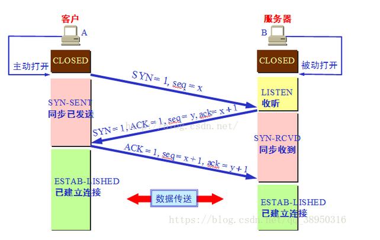
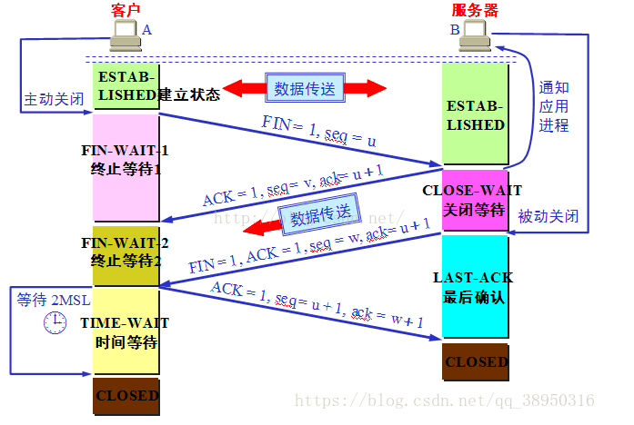
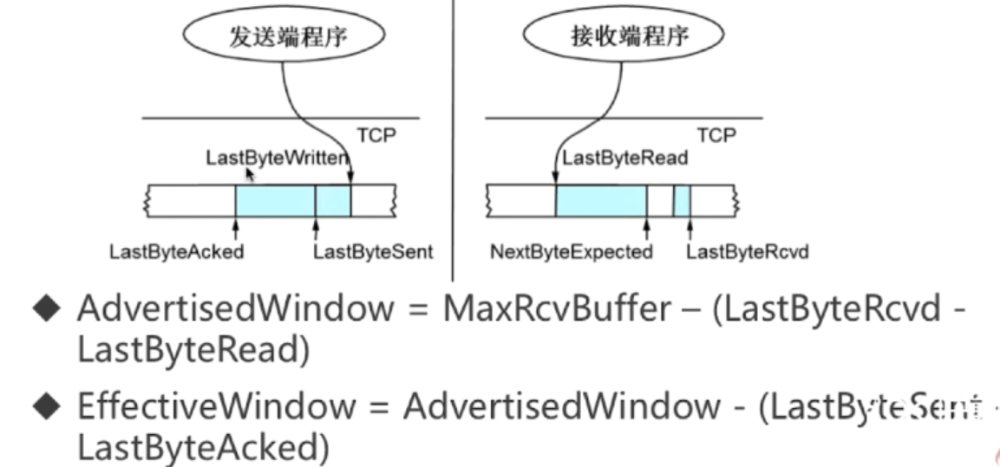
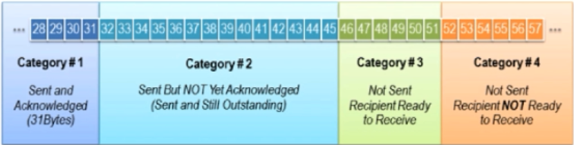
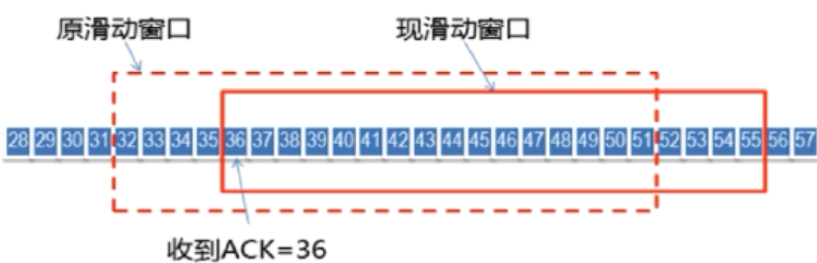
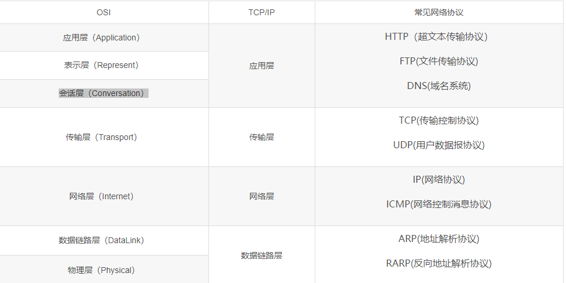
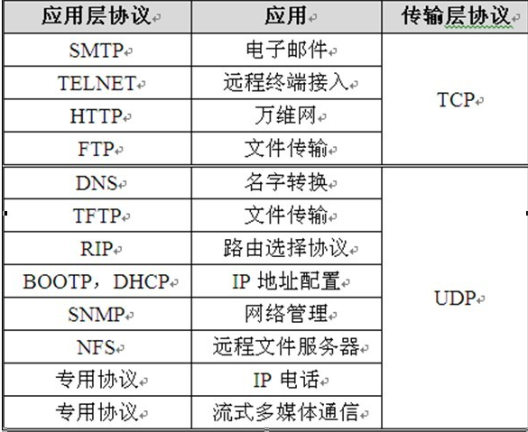
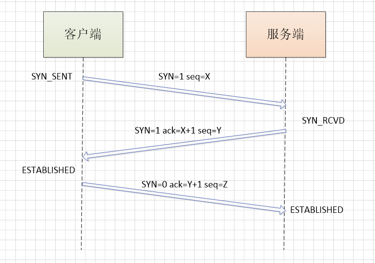
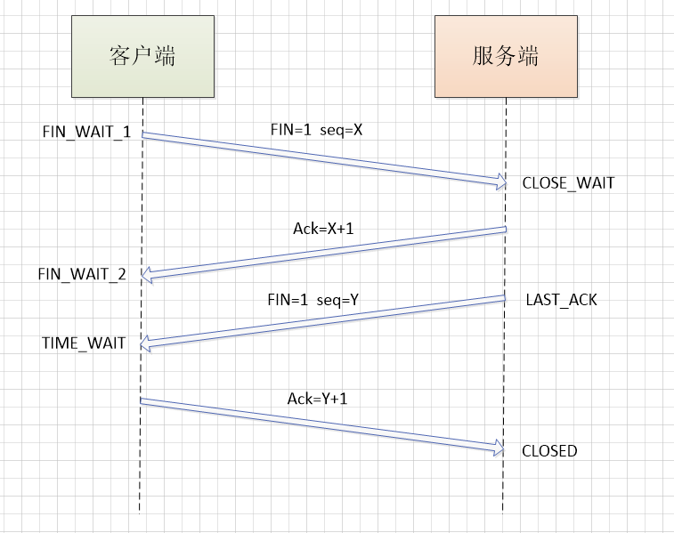

### 1.OSI七层协议

1. 物理层：机械、电子、定时接口通信信道上的原比特流传输。网卡
2. 数据链路层：传输有效的帧以及错误检测功能。交换机
3. 网络层：为数据包选择路由。路由器 ，ip协议
4. 传输层：保证端对端接口。主机之间的数据传输，在必要的时候把数据进行分割，并将这些数据交给网络层。保证这些数据段达到		 
5. 对端。tcp，udp协议
6. 会话层：建立和管理应用程序之间的通讯
7. 表示层：格式化数据，代码转换加密等
8. 应用层：文件传输，电子邮件，文件服务等

### 2.OSI的实现：TCP/IP

- 链路层
- 网络层
- 传输层
- 应用层

### 3.传输控制协议TCP

- 面向连接的、可靠的、基于字节流的传输层通信协议
- 将应用层的数据流分割成报文段并发送给目标节点的TCP层
- 数据包都有序号，对方收到则发送ACK确认，未收到则重传
- 使用校验和来校验数据在传输过程中是否有误

### 4.TCP报文格式

https://www.cnblogs.com/feng9exe/p/8058891.html

### 5.TCP的 三次握手

### 6.TCP的四次挥手

https://blog.csdn.net/qq_38950316/article/details/81087809

### 7.TCP和UDP的区别

### 8.TCP的滑动窗口

1. RTT和RTO
2. RTT：发送一个数据包到收到对应ACK，所花费的时间
3. RTO：重传间隔时间
4. 窗口数据的计算过程

#### 8.1 TCP会话的发送方

发送方的缓存数据4类：已发送并受到回应，已发送等待收到回应，未发送允许发送，不允许发送	

#### 8.2 窗口滑动

#### 8.3 TCP会话的接收方

1.  已接收并发送回执
2.  等待接收
3. 未接收不能接收

### ==面试题-----------------==

### 1.说说四层网络模型（每层的协议及应用）

###  2.谈谈TCP,UDP的区别，分别有哪些应用（可靠，面向连接，首部）

**区别：**

1. ==TCP是面向连接的（类似打电话要先拨号建立连接）；UDP是无连接（据说qq语音，qq视频是基于UDP的，待验证......），即发送数据之前不需要建立连接==
2. ==TCP提供可靠的服务（体现在在传递数据之前，会有三次握手来建立连接）；UDP尽最大努力交付，不保证可靠交付==
3. ==TCP首部开销20字节；UDP首部开销小，只有8字节==
4. 每条TCP连接只能是点到点；UDP支持一对一，一对多，多对一，多对多的交互通信
5. TCP面向字节流，实际上是TCP把数据看成一连串无结构的字节流；UDP是面向报文的
6. ==在流量控制方面，TCP有滑动窗口；UDP没有==
7. ==在拥塞控制方面，TCP有慢开始，拥塞避免，快重传，快恢复等；UDP没有==

应用：

### 3.说说TCP三次握手（为什么是3次，从失效的数据报谈2次为什么不行，从响应时间谈为什么不用4次），四次挥手过程（为什么要等待2MSL）

#### **3.1 三次握手过程：**

##### 3.1.1 第一次握手：

客户端将标志位SYN置为1，表示新连接，并随即生成一个值seq=X，将数据包发给服务端，进入SYN_SENT状态，等待服务端确认

##### 3.1.2.第二次握手：

服务端收到数据包后发现SYN=1，知道是请求建立连接，所以也将标志位SYN置为1，ack=X+1，并生成一个seq=Y，发送数据包给客户端，进入SYN_RCVD状态等待客户端确认

##### 3.1.3.第三次握手：

客户端收到服务端的数据包后，验证ack的数是否正确，若正确则ack=Y+1，发送数据包给服务端；服务端收到后，验证ack数是否正确，正确就明白客户端也能收到自己消息，客户端和服务端都进入ESTABLISHED状态，完成三次握手，等待传输数据

#### **==3.2.为什么三次握手要三次，2次为什么不行？**==

==主要是防止已失效的请求连接报文突然又传送到了，从而产生错误。如：==

​	==A向B发送一个请求，因为某些原因，导致A发出的请求阻塞了很长时间，此时A认为这个连接无效，又重新向B发送了一个连接，B正常收到此连接请求后建立连接，数据传输完成释放连接。如果此时A发出的第一个请求又到达了B，B以为A又发起了一次连接请求，就向A发送确认（此时连接就建立了），对于A而言，它认为没有给B再次发送请求（因为上次通话已结束）所以不理会B这个确认，但是B会一直等待A的消息，造成了浪费。如果是三次握手，A认为没有发起请求，不理会B的确认，B也没有受到A的确认连接，则关闭掉本次连接==

#### **3.3.为什么三次握手要三次，4此为什么不行？**

三次已经能确认互相接收到消息了，4次也可以，但是增加了响应时间，比较多余

#### **3.4.四次挥手过程：**

##### 3.4.1.第一次挥手：

客户端发送一个FIN=1，seq=X，用来关闭客户端-->服务端的数据传送，进入FIN_WAIT_1状态

##### 3.4.2.第二次挥手：

服务端收到客户端的关闭请求后，发送一个ack给客户端，服务的进入CLOSE_WAIT状态

##### 3.4.3.第三次挥手：

服务端发送一个FIN=1，seq=Y，用来关闭服务端-->客户端的数据传送，进入LAST_ACK状态

##### 3.4.4.第四次挥手：

客户端收到服务端的关闭请求后，客户端进入TIME_WAIT状态（客户端经过时间计数器设置的2MSL后，才能进入CLOSED状态），发送ack给服务端，服务端进入CLOSED状态，完成四次挥手

==#### **3.5.四次挥手客户端为什么要等待2MSL？（为什么需要TIME_WAIT状态）？**==

1. 保证客户端发送的最后一个ack报文能够到达服务端，因为这个ack可能会丢失，从而导致处于LAST_ACK的服务端收不到确认报文，会超时重传第三次挥手的内容，如果又丢失的话，又会重传，所以不等待2MSL会导致服务端无法正常进入关闭状态
2. 还可以防止已消失的报文段，保证让迟来的TCP报文段有足够的时间被识别并丢弃

详细的：

​	虽然按道理，四个报文都发送完毕，我们可以直接进入CLOSE状态了，但是我们必须假象网络是不可靠的，有可以最后一个ACK丢失。所以TIME_WAIT状态就是用来重发可能丢失的ACK报文。在Client发送出最后的ACK回复，但该ACK可能丢失。Server如果没有收到ACK，将不断重复发送FIN片段。所以Client不能立即关闭，它必须确认Server接收到了该ACK。Client会在发送出ACK之后进入到TIME_WAIT状态。Client会设置一个计时器，等待2MSL的时间。如果在该时间内再次收到FIN，那么Client会重发ACK并再次等待2MSL。所谓的2MSL是两倍的MSL(Maximum Segment Lifetime)。MSL指一个片段在网络中最大的存活时间，2MSL就是一个发送和一个回复所需的最大时间。如果直到2MSL，Client都没有再次收到FIN，那么Client推断ACK已经被成功接收，则结束TCP连接。

[**https://www.cnblogs.com/yueminghai/p/6646043.html**](https://www.cnblogs.com/yueminghai/p/6646043.html)

### 4.TCP的可靠性，滑动窗口，拥塞控制，超时重传，快重传和快恢复

1. 可靠性（更多是通过重传机制来实现的）
2. 滑动窗口
3. 拥塞控制
4. 超时重传
5. 快重传
6. 快恢复